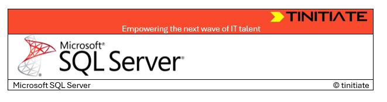

# SQLServer Tutorial

&copy; TINITIATE.COM

## CONTEXT
### [Introduction to Client Tools](introduction.md)
### [Installation Checks Client Tools](installation.md)
### [BCP (Bulk Copy Program)](bcp.md)
### [SQLCMD](sqlcmd.md)

| &copy; TINITIATE.COM |
|----------------------|
