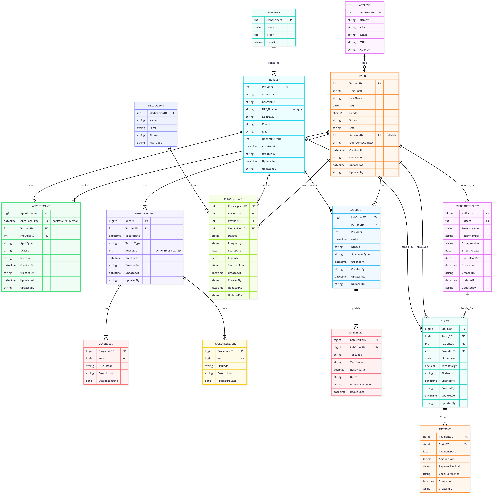

# SQL Server Tutorial
&copy; TINITIATE.COM

##### [Back To Contents](../README.md)

# Healthcare Data Model
This model covers a clinical workflow end-to-end: patients and providers, appointments and medical records, diagnoses/procedures, medications and prescriptions, labs (orders/results), insurance (policies/claims), and payments.  
- **Patient, Address** capture demographics and contact details.  
- **Department, Provider** define the care organization and clinicians.  
- **Appointment** schedules encounters (partitioned by datetime with targeted indexes).  
- **MedicalRecord, Diagnosis, ProcedureRecord** store clinical documentation and coding.  
- **Medication, Prescription** manage medication master data and patient prescriptions.  
- **LabOrder, LabResult** track ordered tests and their outcomes.  
- **InsurancePolicy, Claim, Payment** represent coverage, billing, and remittances.  
Audit columns (`CreatedAt/By`, `UpdatedAt/By`) are included where appropriate; filtered and covering indexes optimize common access paths.


## Patient
* **PatientID**: Surrogate key (PK).  
* **FirstName, LastName, DOB, Gender**: Core demographics.  
* **Phone, Email, AddressID, EmergencyContact**: Contact & next-of-kin.  
* **CreatedAt/By, UpdatedAt/By**: Audit metadata.

## Address
* **AddressID**: Surrogate key (PK).  
* **Street, City, State, ZIP, Country**: Standard address fields.

## Department
* **DepartmentID**: Surrogate key (PK).  
* **Name, Floor, Location**: Organizational unit info.

## Provider
* **ProviderID**: Surrogate key (PK).  
* **FirstName, LastName, NPI_Number (UNIQUE), Specialty**: Clinician identity.  
* **Phone, Email**: Contact.  
* **DepartmentID**: FK → `Department(DepartmentID)`.  
* **CreatedAt/By, UpdatedAt/By**: Audit.

## Appointment (Partitioned)
* **AppointmentID, ApptDateTime**: Composite PK; partitioned on `ApptDateTime` (e.g., `PS_AppointmentYear`).  
* **PatientID**: FK → `Patient(PatientID)`.  
* **ProviderID**: FK → `Provider(ProviderID)`.  
* **ApptType, Status, Location**: Scheduling details.  
* **Created*/Updated***: Audit.  
* **IX_App_PatientDate (filtered)**: Patient + recent dates.  
* **IX_App_ProviderStatus (includes Location)**: Provider + status filtering.

## MedicalRecord
* **RecordID**: Surrogate key (PK).  
* **PatientID**: FK → `Patient(PatientID)`.  
* **RecordDate, RecordType, AuthorID**: Clinical note metadata.  
* **Created*/Updated***: Audit.  
* **IX_MR_PatientDate**: Patient chronological access.

## Diagnosis
* **DiagnosisID**: Surrogate key (PK).  
* **RecordID**: FK → `MedicalRecord(RecordID)`.  
* **ICD10Code, Description, DiagnosedDate**: Coded condition details.

## ProcedureRecord
* **ProcedureID**: Surrogate key (PK).  
* **RecordID**: FK → `MedicalRecord(RecordID)`.  
* **CPTCode, Description, ProcedureDate**: Procedure coding & timing.

## Medication
* **MedicationID**: Surrogate key (PK).  
* **Name, Form, Strength, NDC_Code**: Drug master attributes.

## Prescription
* **PrescriptionID**: Surrogate key (PK).  
* **PatientID**: FK → `Patient(PatientID)`.  
* **ProviderID**: FK → `Provider(ProviderID)`.  
* **MedicationID**: FK → `Medication(MedicationID)`.  
* **Dosage, Frequency, StartDate, EndDate, Instructions**: Prescribing details.  
* **Created*/Updated***: Audit.  
* **IX_Rx_PatientActive (filtered)**: Active prescriptions per patient.

## LabOrder
* **LabOrderID**: Surrogate key (PK).  
* **PatientID**: FK → `Patient(PatientID)`.  
* **ProviderID**: FK → `Provider(ProviderID)`.  
* **OrderDate, Status, SpecimenType**: Order metadata.  
* **Created*/Updated***: Audit.  
* **IX_LO_PatientDate**: Patient orders by date.

## LabResult
* **LabResultID**: Surrogate key (PK).  
* **LabOrderID**: FK → `LabOrder(LabOrderID)`.  
* **TestCode, TestName, ResultValue, Units, ReferenceRange, ResultDate**: Result details.  
* **IX_LR_OrderDate**: Results by order/date.

## InsurancePolicy
* **PolicyID**: Surrogate key (PK).  
* **PatientID**: FK → `Patient(PatientID)`.  
* **InsurerName, PolicyNumber, GroupNumber**: Coverage identifiers.  
* **EffectiveDate, ExpirationDate**: Validity window.  
* **Created*/Updated***: Audit.  
* **IX_IP_PatientActive (filtered)**: Quickly find current policies.

## Claim
* **ClaimID**: Surrogate key (PK).  
* **PolicyID**: FK → `InsurancePolicy(PolicyID)`.  
* **PatientID**: FK → `Patient(PatientID)`.  
* **ProviderID**: FK → `Provider(ProviderID)`.  
* **ClaimDate, TotalCharge, Status**: Billing event details.  
* **Created*/Updated***: Audit.  
* **IX_Clm_DateStatus**: Query by date/status.

## Payment
* **PaymentID**: Surrogate key (PK).  
* **ClaimID**: FK → `Claim(ClaimID)`.  
* **PaymentDate, AmountPaid, PaymentMethod, CheckReference, CreatedAt**: Remittance info.



## DDL Syntax
```sql
-- Create 'healthcare' schema
CREATE SCHEMA healthcare;

-- Create 'PS_AppointmentYear' partition scheme
IF NOT EXISTS (SELECT 1 FROM sys.partition_functions WHERE name = 'PS_AppointmentYear')
BEGIN
  EXEC('CREATE PARTITION FUNCTION PS_AppointmentYear (datetime2(7))
        AS RANGE RIGHT FOR VALUES (''2023-01-01T00:00:00'',''2024-01-01T00:00:00'',''2025-01-01T00:00:00'',''2026-01-01T00:00:00'',''2027-01-01T00:00:00'');');
END;
IF NOT EXISTS (SELECT 1 FROM sys.partition_schemes WHERE name = 'PS_AppointmentYear')
BEGIN
  EXEC('CREATE PARTITION SCHEME PS_AppointmentYear
        AS PARTITION PS_AppointmentYear
        ALL TO ([PRIMARY]);');
END;

-- Create 'Address' table
CREATE TABLE healthcare.Address
(
  AddressID    INT           IDENTITY(1,1),
  Street       NVARCHAR(150) NOT NULL,
  City         NVARCHAR(50)  NOT NULL,
  State        NVARCHAR(50)  NOT NULL,
  ZIP          NVARCHAR(15)  NOT NULL,
  Country      NVARCHAR(50)  NOT NULL
);
ALTER TABLE healthcare.Address
  ADD CONSTRAINT PK_Address PRIMARY KEY CLUSTERED (AddressID);

-- Create 'Department' table
CREATE TABLE healthcare.Department
(
  DepartmentID INT           IDENTITY(1,1),
  Name         NVARCHAR(100) NOT NULL,
  Floor        INT           NULL,
  Location     NVARCHAR(100) NULL
);
ALTER TABLE healthcare.Department
  ADD CONSTRAINT PK_Department PRIMARY KEY CLUSTERED (DepartmentID);

-- Create 'Patient' table
CREATE TABLE healthcare.Patient
(
  PatientID         INT           IDENTITY(1,1),
  FirstName         NVARCHAR(50)  NOT NULL,
  LastName          NVARCHAR(50)  NOT NULL,
  DOB               DATE          NOT NULL,
  Gender            CHAR(1)       NOT NULL,
  Phone             VARCHAR(20)   NULL,
  Email             VARCHAR(100)  NULL,
  AddressID         INT           NULL,
  EmergencyContact  NVARCHAR(100) NULL,
  -- Audit
  CreatedAt         DATETIME2     NOT NULL DEFAULT SYSUTCDATETIME(),
  CreatedBy         SYSNAME       NOT NULL DEFAULT SUSER_SNAME(),
  UpdatedAt         DATETIME2     NOT NULL DEFAULT SYSUTCDATETIME(),
  UpdatedBy         SYSNAME       NOT NULL DEFAULT SUSER_SNAME()
);
ALTER TABLE healthcare.Patient
  ADD CONSTRAINT PK_Patient PRIMARY KEY CLUSTERED (PatientID);
ALTER TABLE healthcare.Patient
  ADD CONSTRAINT FK_Cust_Address
      FOREIGN KEY (AddressID)
      REFERENCES healthcare.Address(AddressID);

-- Create 'Provider' table
CREATE TABLE healthcare.Provider
(
  ProviderID    INT           IDENTITY(1,1),
  FirstName     NVARCHAR(50)  NOT NULL,
  LastName      NVARCHAR(50)  NOT NULL,
  NPI_Number    VARCHAR(20)   NOT NULL,
  Specialty     NVARCHAR(100) NULL,
  Phone         VARCHAR(20)   NULL,
  Email         VARCHAR(100)  NULL,
  DepartmentID  INT           NOT NULL,
  CreatedAt     DATETIME2     NOT NULL DEFAULT SYSUTCDATETIME(),
  CreatedBy     SYSNAME       NOT NULL DEFAULT SUSER_SNAME(),
  UpdatedAt     DATETIME2     NOT NULL DEFAULT SYSUTCDATETIME(),
  UpdatedBy     SYSNAME       NOT NULL DEFAULT SUSER_SNAME()
);
ALTER TABLE healthcare.Provider
  ADD CONSTRAINT PK_Provider PRIMARY KEY CLUSTERED (ProviderID);
ALTER TABLE healthcare.Provider
  ADD CONSTRAINT UQ_Provider_NPI UNIQUE (NPI_Number);
ALTER TABLE healthcare.Provider
  ADD CONSTRAINT FK_Provider_Department
      FOREIGN KEY (DepartmentID)
      REFERENCES healthcare.Department(DepartmentID);

-- Create 'Appointment' table
CREATE TABLE healthcare.Appointment
(
  AppointmentID  BIGINT         NOT NULL,
  PatientID      INT            NOT NULL,
  ProviderID     INT            NOT NULL,
  ApptDateTime   DATETIME2      NOT NULL,
  ApptType       NVARCHAR(50)   NULL,
  Status         NVARCHAR(20)   NULL,
  Location       NVARCHAR(100)  NULL,
  CreatedAt      DATETIME2      NOT NULL DEFAULT SYSUTCDATETIME(),
  CreatedBy      SYSNAME        NOT NULL DEFAULT SUSER_SNAME(),
  UpdatedAt      DATETIME2      NOT NULL DEFAULT SYSUTCDATETIME(),
  UpdatedBy      SYSNAME        NOT NULL DEFAULT SUSER_SNAME()
);
ALTER TABLE healthcare.Appointment
  ADD CONSTRAINT PK_Appointment
      PRIMARY KEY CLUSTERED (AppointmentID, ApptDateTime)
      ON PS_AppointmentYear(ApptDateTime);
ALTER TABLE healthcare.Appointment
  ADD CONSTRAINT FK_Appt_Patient
      FOREIGN KEY (PatientID)
      REFERENCES healthcare.Patient(PatientID);
ALTER TABLE healthcare.Appointment
  ADD CONSTRAINT FK_Appt_Provider
      FOREIGN KEY (ProviderID)
      REFERENCES healthcare.Provider(ProviderID);
-- Create an index for 'Appointment' table
CREATE INDEX IX_App_PatientDate
  ON healthcare.Appointment(PatientID, ApptDateTime DESC)
  WHERE ApptDateTime >= '2023-01-01';
-- Create an index for 'Appointment' table
CREATE INDEX IX_App_ProviderStatus
  ON healthcare.Appointment(ProviderID, Status)
  INCLUDE (Location);

-- Create 'MedicalRecord' table
CREATE TABLE healthcare.MedicalRecord
(
  RecordID     BIGINT         IDENTITY(1,1),
  PatientID    INT            NOT NULL,
  RecordDate   DATETIME2      NOT NULL,
  RecordType   NVARCHAR(50)   NULL,
  AuthorID     INT            NOT NULL,  -- could be ProviderID or StaffID
  CreatedAt    DATETIME2      NOT NULL DEFAULT SYSUTCDATETIME(),
  CreatedBy    SYSNAME        NOT NULL DEFAULT SUSER_SNAME(),
  UpdatedAt    DATETIME2      NOT NULL DEFAULT SYSUTCDATETIME(),
  UpdatedBy    SYSNAME        NOT NULL DEFAULT SUSER_SNAME()
);
ALTER TABLE healthcare.MedicalRecord
  ADD CONSTRAINT PK_MedicalRecord PRIMARY KEY CLUSTERED (RecordID);
ALTER TABLE healthcare.MedicalRecord
  ADD CONSTRAINT FK_MR_Patient
      FOREIGN KEY (PatientID)
      REFERENCES healthcare.Patient(PatientID);
-- Create an index for 'MedicalRecord' table
CREATE INDEX IX_MR_PatientDate
  ON healthcare.MedicalRecord(PatientID, RecordDate);

-- Create 'Diagnosis' table
CREATE TABLE healthcare.Diagnosis
(
  DiagnosisID   BIGINT       IDENTITY(1,1),
  RecordID      BIGINT       NOT NULL,
  ICD10Code     VARCHAR(10)  NOT NULL,
  Description   NVARCHAR(255) NULL,
  DiagnosedDate DATE          NOT NULL
);
ALTER TABLE healthcare.Diagnosis
  ADD CONSTRAINT PK_Diagnosis PRIMARY KEY CLUSTERED (DiagnosisID);
ALTER TABLE healthcare.Diagnosis
  ADD CONSTRAINT FK_Dx_Record
      FOREIGN KEY (RecordID)
      REFERENCES healthcare.MedicalRecord(RecordID);

-- Create 'ProcedureRecord' table
CREATE TABLE healthcare.ProcedureRecord
(
  ProcedureID    BIGINT       IDENTITY(1,1),
  RecordID       BIGINT       NOT NULL,
  CPTCode        VARCHAR(10)  NOT NULL,
  Description    NVARCHAR(255) NULL,
  ProcedureDate  DATE         NOT NULL
);
ALTER TABLE healthcare.ProcedureRecord
  ADD CONSTRAINT PK_ProcedureRecord PRIMARY KEY CLUSTERED (ProcedureID);
ALTER TABLE healthcare.ProcedureRecord
  ADD CONSTRAINT FK_Proc_Record
      FOREIGN KEY (RecordID)
      REFERENCES healthcare.MedicalRecord(RecordID);

-- Create 'Medication' table
CREATE TABLE healthcare.Medication
(
  MedicationID   INT           IDENTITY(1,1),
  Name           NVARCHAR(150) NOT NULL,
  Form           NVARCHAR(50)  NULL,
  Strength       NVARCHAR(50)  NULL,
  NDC_Code       VARCHAR(20)   NULL
);
ALTER TABLE healthcare.Medication
  ADD CONSTRAINT PK_Medication PRIMARY KEY CLUSTERED (MedicationID);

-- Create 'Prescription' table
CREATE TABLE healthcare.Prescription
(
  PrescriptionID INT           IDENTITY(1,1),
  PatientID      INT           NOT NULL,
  ProviderID     INT           NOT NULL,
  MedicationID   INT           NOT NULL,
  Dosage         NVARCHAR(100) NULL,
  Frequency      NVARCHAR(100) NULL,
  StartDate      DATE          NOT NULL,
  EndDate        DATE          NULL,
  Instructions   NVARCHAR(500) NULL,
  CreatedAt      DATETIME2     NOT NULL DEFAULT SYSUTCDATETIME(),
  CreatedBy      SYSNAME       NOT NULL DEFAULT SUSER_SNAME(),
  UpdatedAt      DATETIME2     NOT NULL DEFAULT SYSUTCDATETIME(),
  UpdatedBy      SYSNAME       NOT NULL DEFAULT SUSER_SNAME()
);
ALTER TABLE healthcare.Prescription
  ADD CONSTRAINT PK_Prescription PRIMARY KEY CLUSTERED (PrescriptionID);
ALTER TABLE healthcare.Prescription
  ADD CONSTRAINT FK_Rx_Patient
      FOREIGN KEY (PatientID)
      REFERENCES healthcare.Patient(PatientID);
ALTER TABLE healthcare.Prescription
  ADD CONSTRAINT FK_Rx_Provider
      FOREIGN KEY (ProviderID)
      REFERENCES healthcare.Provider(ProviderID);
ALTER TABLE healthcare.Prescription
  ADD CONSTRAINT FK_Rx_Med
      FOREIGN KEY (MedicationID)
      REFERENCES healthcare.Medication(MedicationID);
-- Create an index for 'Prescription' table
CREATE INDEX IX_Rx_PatientActive
  ON healthcare.Prescription(PatientID)
  WHERE EndDate IS NULL;

-- Create 'LabOrder' table
CREATE TABLE healthcare.LabOrder
(
  LabOrderID   BIGINT       IDENTITY(1,1),
  PatientID    INT          NOT NULL,
  ProviderID   INT          NOT NULL,
  OrderDate    DATETIME2    NOT NULL,
  Status       NVARCHAR(50) NULL,
  SpecimenType NVARCHAR(100)NULL,
  CreatedAt    DATETIME2    NOT NULL DEFAULT SYSUTCDATETIME(),
  CreatedBy    SYSNAME      NOT NULL DEFAULT SUSER_SNAME(),
  UpdatedAt    DATETIME2    NOT NULL DEFAULT SYSUTCDATETIME(),
  UpdatedBy    SYSNAME      NOT NULL DEFAULT SUSER_SNAME()
);
ALTER TABLE healthcare.LabOrder
  ADD CONSTRAINT PK_LabOrder PRIMARY KEY CLUSTERED (LabOrderID);
ALTER TABLE healthcare.LabOrder
  ADD CONSTRAINT FK_LO_Patient
      FOREIGN KEY (PatientID)
      REFERENCES healthcare.Patient(PatientID);
ALTER TABLE healthcare.LabOrder
  ADD CONSTRAINT FK_LO_Prov
      FOREIGN KEY (ProviderID)
      REFERENCES healthcare.Provider(ProviderID);
-- Create an index for 'LabOrder' table
CREATE INDEX IX_LO_PatientDate
  ON healthcare.LabOrder(PatientID, OrderDate DESC);

-- Create 'LabResult' table
CREATE TABLE healthcare.LabResult
(
  LabResultID    BIGINT       IDENTITY(1,1),
  LabOrderID     BIGINT       NOT NULL,
  TestCode       VARCHAR(20)  NOT NULL,
  TestName       NVARCHAR(100)NOT NULL,
  ResultValue    DECIMAL(18,4)NULL,
  Units          NVARCHAR(50) NULL,
  ReferenceRange NVARCHAR(100) NULL,
  ResultDate     DATETIME2    NOT NULL
);
ALTER TABLE healthcare.LabResult
  ADD CONSTRAINT PK_LabResult PRIMARY KEY CLUSTERED (LabResultID);
ALTER TABLE healthcare.LabResult
  ADD CONSTRAINT FK_LR_Order
      FOREIGN KEY (LabOrderID)
      REFERENCES healthcare.LabOrder(LabOrderID);
-- Create an index for 'LabResult' table
CREATE INDEX IX_LR_OrderDate
  ON healthcare.LabResult(LabOrderID, ResultDate);

-- Create 'InsurancePolicy' table
CREATE TABLE healthcare.InsurancePolicy
(
  PolicyID       BIGINT      IDENTITY(1,1),
  PatientID      INT         NOT NULL,
  InsurerName    NVARCHAR(150)NOT NULL,
  PolicyNumber   VARCHAR(50) NOT NULL,
  GroupNumber    VARCHAR(50) NULL,
  EffectiveDate  DATE        NOT NULL,
  ExpirationDate DATE        NULL,
  CreatedAt      DATETIME2   NOT NULL DEFAULT SYSUTCDATETIME(),
  CreatedBy      SYSNAME     NOT NULL DEFAULT SUSER_SNAME(),
  UpdatedAt      DATETIME2   NOT NULL DEFAULT SYSUTCDATETIME(),
  UpdatedBy      SYSNAME     NOT NULL DEFAULT SUSER_SNAME()
);
ALTER TABLE healthcare.InsurancePolicy
  ADD CONSTRAINT PK_InsurancePolicy PRIMARY KEY CLUSTERED (PolicyID);
ALTER TABLE healthcare.InsurancePolicy
  ADD CONSTRAINT FK_IP_Patient
      FOREIGN KEY (PatientID)
      REFERENCES healthcare.Patient(PatientID);
-- Create an index for 'InsurancePolicy' table
CREATE INDEX IX_IP_Patient_ExpDate
  ON healthcare.InsurancePolicy(PatientID, ExpirationDate);
CREATE INDEX IX_IP_Patient_ExpirationNull
  ON healthcare.InsurancePolicy(PatientID)
  WHERE ExpirationDate IS NULL;

-- Create 'Claim' table
CREATE TABLE healthcare.Claim
(
  ClaimID        BIGINT      IDENTITY(1,1),
  PolicyID       BIGINT      NOT NULL,
  PatientID      INT         NOT NULL,
  ProviderID     INT         NOT NULL,
  ClaimDate      DATE        NOT NULL,
  TotalCharge    DECIMAL(18,2)NOT NULL,
  Status         NVARCHAR(50) NULL,
  CreatedAt      DATETIME2   NOT NULL DEFAULT SYSUTCDATETIME(),
  CreatedBy      SYSNAME     NOT NULL DEFAULT SUSER_SNAME(),
  UpdatedAt      DATETIME2   NOT NULL DEFAULT SYSUTCDATETIME(),
  UpdatedBy      SYSNAME     NOT NULL DEFAULT SUSER_SNAME()
);
ALTER TABLE healthcare.Claim
  ADD CONSTRAINT PK_Claim PRIMARY KEY CLUSTERED (ClaimID);
ALTER TABLE healthcare.Claim
  ADD CONSTRAINT FK_Clm_Policy
      FOREIGN KEY (PolicyID)
      REFERENCES healthcare.InsurancePolicy(PolicyID);
ALTER TABLE healthcare.Claim
  ADD CONSTRAINT FK_Clm_Patient
      FOREIGN KEY (PatientID)
      REFERENCES healthcare.Patient(PatientID);
ALTER TABLE healthcare.Claim
  ADD CONSTRAINT FK_Clm_Prov
      FOREIGN KEY (ProviderID)
      REFERENCES healthcare.Provider(ProviderID);
-- Create an index for 'Claim' table
CREATE INDEX IX_Clm_DateStatus
  ON healthcare.Claim(ClaimDate, Status);

-- Create 'Payment' table
CREATE TABLE healthcare.Payment
(
  PaymentID      BIGINT      IDENTITY(1,1),
  ClaimID        BIGINT      NOT NULL,
  PaymentDate    DATE        NOT NULL,
  AmountPaid     DECIMAL(18,2)NOT NULL,
  PaymentMethod  NVARCHAR(50) NULL,
  CheckReference VARCHAR(50) NULL,
  CreatedAt      DATETIME2   NOT NULL DEFAULT SYSUTCDATETIME(),
  CreatedBy      SYSNAME     NOT NULL DEFAULT SUSER_SNAME()
);
ALTER TABLE healthcare.Payment
  ADD CONSTRAINT PK_Payment PRIMARY KEY CLUSTERED (PaymentID);
ALTER TABLE healthcare.Payment
  ADD CONSTRAINT FK_Pmt_Claim
      FOREIGN KEY (ClaimID)
      REFERENCES healthcare.Claim(ClaimID);
```

## DML Syntax
```sql
/* ===================================================================
   HEALTHCARE COMPANY – BULK DATA GENERATOR (inline generators)
   Prereq: Tables + PS_AppointmentYear already exist.
   ===================================================================*/
SET NOCOUNT ON;

/* ===================================================================
   Tunables
   ===================================================================*/
DECLARE 
  @addrCount          int = 2000,
  @deptCount          int = 25,
  @patientCount       int = 12000,
  @providerCount      int = 1200,
  @appointmentCount   int = 60000,

  @medRecordCount     int = 25000,
  @dxPerRecord        int = 2,
  @procPerRecord      int = 1,

  @medicationCount    int = 800,
  @prescriptionCount  int = 40000,

  @labOrderCount      int = 20000,
  @labResultsPerOrder int = 3,

  @policyCount        int = 18000,
  @claimCount         int = 22000,
  @paymentsPerClaim   int = 1;  -- set to 2 or 3 if you want split payments

DECLARE 
  @startDate date = '2025-07-01',
  @endDate   date = '2025-07-31';

/* ===================================================================
   1) Address
   ===================================================================*/
INSERT INTO healthcare.Address (Street, City, State, ZIP, Country)
SELECT 
  CONCAT('No.', N.n, ' ', CASE N.n%6 WHEN 0 THEN 'Main' WHEN 1 THEN 'Oak' WHEN 2 THEN 'Maple'
                                     WHEN 3 THEN 'Pine' WHEN 4 THEN 'Cedar' ELSE 'Elm' END, ' St'),
  CONCAT('City', N.n % 300),
  CONCAT('State', N.n % 50),
  CONCAT('Z', RIGHT('00000'+CONVERT(varchar(8), 10000 + (N.n%90000)), 5)),
  CASE N.n%6 WHEN 0 THEN 'USA' WHEN 1 THEN 'India' WHEN 2 THEN 'UK' 
             WHEN 3 THEN 'Germany' WHEN 4 THEN 'Brazil' ELSE 'Canada' END
FROM (
  SELECT TOP (@addrCount) ROW_NUMBER() OVER (ORDER BY (SELECT NULL)) AS n
  FROM sys.all_objects a
) AS N;

DECLARE @addrMax int = (SELECT MAX(AddressID) FROM healthcare.Address);

/* ===================================================================
   2) Department
   ===================================================================*/
INSERT INTO healthcare.Department (Name, Floor, Location)
SELECT
  CONCAT('Dept-', RIGHT('000'+CONVERT(varchar(10), N.n),3)),
  1 + (N.n % 12),
  CONCAT('Building-', CHAR(65 + (N.n%5)))
FROM (
  SELECT TOP (@deptCount) ROW_NUMBER() OVER (ORDER BY (SELECT NULL)) AS n
  FROM sys.all_objects
) AS N;

DECLARE @deptMax int = (SELECT MAX(DepartmentID) FROM healthcare.Department);

/* ===================================================================
   3) Patient
   ===================================================================*/
INSERT INTO healthcare.Patient
(FirstName, LastName, DOB, Gender, Phone, Email, AddressID, EmergencyContact)
SELECT
  CONCAT('PatFirst', N.n),
  CONCAT('PatLast',  N.n),
  DATEADD(DAY, - (N.n % 20000), CAST(@endDate AS datetime2)), -- spread DOBs
  CASE N.n%2 WHEN 0 THEN 'M' ELSE 'F' END,
  CONCAT('+1-444-', RIGHT('0000'+CONVERT(varchar(10), 3000+(N.n%8000)),4)),
  CONCAT('patient', N.n, '@example.com'),
  ((N.n*3-1)%@addrMax)+1,
  CONCAT('EC-', RIGHT('000000'+CONVERT(varchar(10), N.n),6))
FROM (
  SELECT TOP (@patientCount) ROW_NUMBER() OVER (ORDER BY (SELECT NULL)) AS n
  FROM sys.all_objects a CROSS JOIN sys.all_objects b
) AS N;

DECLARE @patientMax int = (SELECT MAX(PatientID) FROM healthcare.Patient);

/* ===================================================================
   4) Provider (unique NPI, FK to Department)
   ===================================================================*/
INSERT INTO healthcare.Provider
(FirstName, LastName, NPI_Number, Specialty, Phone, Email, DepartmentID)
SELECT
  CONCAT('ProvFirst', N.n),
  CONCAT('ProvLast',  N.n),
  RIGHT('0000000000'+CONVERT(varchar(20), 1000000000 + N.n), 10), -- unique NPI-like
  CASE N.n%8 WHEN 0 THEN 'Internal Medicine' WHEN 1 THEN 'Family Medicine' WHEN 2 THEN 'Cardiology'
             WHEN 3 THEN 'Pediatrics' WHEN 4 THEN 'Orthopedics' WHEN 5 THEN 'Neurology'
             WHEN 6 THEN 'Dermatology' ELSE 'Oncology' END,
  CONCAT('+1-555-', RIGHT('0000'+CONVERT(varchar(10), 2000+(N.n%8000)),4)),
  CONCAT('provider', N.n, '@example.com'),
  ((N.n-1)%@deptMax)+1
FROM (
  SELECT TOP (@providerCount) ROW_NUMBER() OVER (ORDER BY (SELECT NULL)) AS n
  FROM sys.all_objects a CROSS JOIN sys.all_objects b
) AS N;

DECLARE @providerMax int = (SELECT MAX(ProviderID) FROM healthcare.Provider);

/* ===================================================================
   5) Appointment (composite PK (AppointmentID, ApptDateTime) on partition scheme)
   ===================================================================*/
INSERT INTO healthcare.Appointment
(AppointmentID, PatientID, ProviderID, ApptDateTime, ApptType, Status, Location)
SELECT
  6000000 + N.rn AS AppointmentID,
  ((N.rn*7-3) % @patientMax) + 1 AS PatientID,
  ((N.rn*11-5)% @providerMax) + 1 AS ProviderID,
  DATEADD(MINUTE, (N.rn % (24*60)),
    CAST(DATEADD(DAY, N.rn % DATEDIFF(DAY, @startDate, DATEADD(DAY,1,@endDate)), @startDate) AS datetime2)) AS ApptDateTime,
  CASE N.rn%6 WHEN 0 THEN 'Follow-up' WHEN 1 THEN 'New Patient' WHEN 2 THEN 'Annual'
              WHEN 3 THEN 'Consult' WHEN 4 THEN 'Telehealth' ELSE 'Procedure' END,
  CASE N.rn%7 WHEN 0 THEN 'Cancelled' WHEN 1 THEN 'No-Show' WHEN 2 THEN 'Rescheduled'
              ELSE 'Completed' END,
  CONCAT('Room-', RIGHT('000'+CONVERT(varchar(10), (N.rn%300)+1), 3))
FROM (
  SELECT TOP (@appointmentCount) ROW_NUMBER() OVER (ORDER BY (SELECT NULL)) AS rn
  FROM sys.all_objects a CROSS JOIN sys.all_objects b
) AS N;

/* ===================================================================
   6) MedicalRecord (FK to Patient, AuthorID ~ Provider)
   ===================================================================*/
INSERT INTO healthcare.MedicalRecord
(PatientID, RecordDate, RecordType, AuthorID)
SELECT
  ((N.rn*9-4) % @patientMax) + 1,
  DATEADD(HOUR, (N.rn % (24*14)), -- spread across days/hours
    CAST(DATEADD(DAY, N.rn % DATEDIFF(DAY, @startDate, DATEADD(DAY,1,@endDate)), @startDate) AS datetime2)),
  CASE N.rn%5 WHEN 0 THEN 'Progress Note' WHEN 1 THEN 'Consult Note' WHEN 2 THEN 'Discharge Summary'
              WHEN 3 THEN 'Operative Note' ELSE 'Follow-up' END,
  ((N.rn*13-7) % @providerMax) + 1  -- Author is a provider
FROM (
  SELECT TOP (@medRecordCount) ROW_NUMBER() OVER (ORDER BY (SELECT NULL)) AS rn
  FROM sys.all_objects a CROSS JOIN sys.all_objects b
) AS N;

DECLARE @mrMax bigint = (SELECT MAX(RecordID) FROM healthcare.MedicalRecord);

/* ===================================================================
   7) Diagnosis (~ @dxPerRecord per MedicalRecord)
   ===================================================================*/
INSERT INTO healthcare.Diagnosis (RecordID, ICD10Code, Description, DiagnosedDate)
SELECT
  R.RecordID,
  CONCAT('I', RIGHT('00'+CONVERT(varchar(10), (R.rn*7)%99),2), '.', RIGHT('0'+CONVERT(varchar(10), (R.rn*11)%9),1)),
  CONCAT('Diagnosis ', R.rn),
  CAST(R.RecordDate AS date)
FROM (
  SELECT RecordID, RecordDate, ROW_NUMBER() OVER (ORDER BY RecordID) AS rn
  FROM healthcare.MedicalRecord
) AS R
CROSS JOIN (
  SELECT TOP (@dxPerRecord) 1 AS t
  FROM sys.all_objects
) AS T;

/* ===================================================================
   8) ProcedureRecord (~ @procPerRecord per MedicalRecord)
   ===================================================================*/
INSERT INTO healthcare.ProcedureRecord (RecordID, CPTCode, Description, ProcedureDate)
SELECT
  R.RecordID,
  RIGHT('00000'+CONVERT(varchar(10), 10000 + (R.rn*37)%90000),5),
  CONCAT('Procedure for record ', R.RecordID),
  CAST(R.RecordDate AS date)
FROM (
  SELECT RecordID, RecordDate, ROW_NUMBER() OVER (ORDER BY RecordID) AS rn
  FROM healthcare.MedicalRecord
) AS R
CROSS JOIN (
  SELECT TOP (@procPerRecord) 1 AS t
  FROM sys.all_objects
) AS T;

/* ===================================================================
   9) Medication (master)
   ===================================================================*/
INSERT INTO healthcare.Medication (Name, Form, Strength, NDC_Code)
SELECT
  CONCAT('Med-', RIGHT('0000'+CONVERT(varchar(10), N.n),4)),
  CASE N.n%5 WHEN 0 THEN 'Tablet' WHEN 1 THEN 'Capsule' WHEN 2 THEN 'Syrup' WHEN 3 THEN 'Injection' ELSE 'Ointment' END,
  CASE N.n%6 WHEN 0 THEN '5 mg' WHEN 1 THEN '10 mg' WHEN 2 THEN '20 mg'
             WHEN 3 THEN '250 mg' WHEN 4 THEN '500 mg' ELSE '1 g' END,
  CONCAT(RIGHT('00000'+CONVERT(varchar(10), 10000 + (N.n%90000)),5),'-',
         RIGHT('0000'+CONVERT(varchar(10), 1000 + ((N.n*7)%9000)),4),'-',
         RIGHT('00'+CONVERT(varchar(10), 10 + ((N.n*13)%90)),2))
FROM (
  SELECT TOP (@medicationCount) ROW_NUMBER() OVER (ORDER BY (SELECT NULL)) AS n
  FROM sys.all_objects
) AS N;

DECLARE @medMax int = (SELECT MAX(MedicationID) FROM healthcare.Medication);

/* ===================================================================
   10) Prescription (FKs to Patient, Provider, Medication)
   ===================================================================*/
INSERT INTO healthcare.Prescription
(PatientID, ProviderID, MedicationID, Dosage, Frequency, StartDate, EndDate, Instructions)
SELECT
  ((N.rn*5-1) % @patientMax) + 1,
  ((N.rn*17-3)% @providerMax) + 1,
  ((N.rn*19-7)% @medMax) + 1,
  CONCAT(1 + (N.rn%2), ' tab'),
  CASE N.rn%5 WHEN 0 THEN 'Once daily' WHEN 1 THEN 'BID' WHEN 2 THEN 'TID' WHEN 3 THEN 'QID' ELSE 'PRN' END,
  DATEADD(DAY, N.rn % DATEDIFF(DAY, @startDate, DATEADD(DAY,1,@endDate)), @startDate),
  CASE WHEN N.rn % 4 = 0 THEN NULL
       ELSE DATEADD(DAY, 7 + (N.rn%21),
            DATEADD(DAY, N.rn % DATEDIFF(DAY, @startDate, DATEADD(DAY,1,@endDate)), @startDate)) END,
  N'With water'
FROM (
  SELECT TOP (@prescriptionCount) ROW_NUMBER() OVER (ORDER BY (SELECT NULL)) AS rn
  FROM sys.all_objects a CROSS JOIN sys.all_objects b
) AS N;

/* ===================================================================
   11) LabOrder (FKs to Patient, Provider)
   ===================================================================*/
INSERT INTO healthcare.LabOrder
(PatientID, ProviderID, OrderDate, Status, SpecimenType)
SELECT
  ((N.rn*7-5) % @patientMax) + 1,
  ((N.rn*3-1)  % @providerMax) + 1,
  DATEADD(HOUR, (N.rn % (24*7)),
    CAST(DATEADD(DAY, N.rn % DATEDIFF(DAY, @startDate, DATEADD(DAY,1,@endDate)), @startDate) AS datetime2)),
  CASE N.rn%4 WHEN 0 THEN 'Ordered' WHEN 1 THEN 'Collected' WHEN 2 THEN 'In-Process' ELSE 'Resulted' END,
  CASE N.rn%5 WHEN 0 THEN 'Blood' WHEN 1 THEN 'Urine' WHEN 2 THEN 'Stool' WHEN 3 THEN 'Saliva' ELSE 'Tissue' END
FROM (
  SELECT TOP (@labOrderCount) ROW_NUMBER() OVER (ORDER BY (SELECT NULL)) AS rn
  FROM sys.all_objects a CROSS JOIN sys.all_objects b
) AS N;

DECLARE @labOrderMax bigint = (SELECT MAX(LabOrderID) FROM healthcare.LabOrder);

/* ===================================================================
   12) LabResult (~ @labResultsPerOrder per LabOrder)
   ===================================================================*/
INSERT INTO healthcare.LabResult
(LabOrderID, TestCode, TestName, ResultValue, Units, ReferenceRange, ResultDate)
SELECT
  LO.LabOrderID,
  CONCAT('T', RIGHT('0000'+CONVERT(varchar(10), (LO.rn*17 + T.t)%10000),4)),
  CASE (T.t%6) WHEN 0 THEN 'CBC' WHEN 1 THEN 'CMP' WHEN 2 THEN 'Lipid Panel'
               WHEN 3 THEN 'HbA1c' WHEN 4 THEN 'TSH' ELSE 'CRP' END,
  CAST( (ABS(CHECKSUM(NEWID())) % 1000) / 10.0 AS decimal(18,4)),
  CASE (T.t%6) WHEN 0 THEN '10^9/L' WHEN 1 THEN 'mg/dL' WHEN 2 THEN 'mg/dL'
               WHEN 3 THEN '%' WHEN 4 THEN 'mIU/L' ELSE 'mg/L' END,
  CASE (T.t%6) WHEN 0 THEN '4-11' WHEN 1 THEN '70-110' WHEN 2 THEN '< 200'
               WHEN 3 THEN '4.0-5.6' WHEN 4 THEN '0.4-4.0' ELSE '< 5' END,
  DATEADD(HOUR, 24 + (T.t % 24), LO.OrderDate)
FROM (
  SELECT LabOrderID, OrderDate, ROW_NUMBER() OVER (ORDER BY LabOrderID) AS rn
  FROM healthcare.LabOrder
) AS LO
CROSS JOIN (
  SELECT TOP (@labResultsPerOrder) ROW_NUMBER() OVER (ORDER BY (SELECT NULL)) AS t
  FROM sys.all_objects
) AS T;

/* ===================================================================
   13) InsurancePolicy (FK to Patient) + helpful indexes already added
   ===================================================================*/
INSERT INTO healthcare.InsurancePolicy
(PatientID, InsurerName, PolicyNumber, GroupNumber, EffectiveDate, ExpirationDate)
SELECT
  ((N.rn*9-2) % @patientMax) + 1,
  CASE N.rn%6 WHEN 0 THEN 'BlueShield' WHEN 1 THEN 'UnitedCare' WHEN 2 THEN 'Aetna'
              WHEN 3 THEN 'Cigna' WHEN 4 THEN 'Humana' ELSE 'Kaiser' END,
  CONCAT('PL', RIGHT('0000000'+CONVERT(varchar(10), 1000000 + N.rn),7)),
  CONCAT('GRP', RIGHT('00000'+CONVERT(varchar(10), (N.rn*13)%100000),5)),
  DATEADD(DAY, - (N.rn % 365), @startDate),
  CASE N.rn%5 WHEN 0 THEN NULL ELSE DATEADD(DAY, 180 + (N.rn%365), @startDate) END
FROM (
  SELECT TOP (@policyCount) ROW_NUMBER() OVER (ORDER BY (SELECT NULL)) AS rn
  FROM sys.all_objects a CROSS JOIN sys.all_objects b
) AS N;

DECLARE @policyMax bigint = (SELECT MAX(PolicyID) FROM healthcare.InsurancePolicy);

/* ===================================================================
   14) Claim (FKs to Policy, Patient, Provider)
   ===================================================================*/
INSERT INTO healthcare.Claim
(PolicyID, PatientID, ProviderID, ClaimDate, TotalCharge, Status)
SELECT
  ((N.rn-1)%@policyMax)+1 AS PolicyID,
  IP.PatientID,
  ((N.rn*7-1) % @providerMax) + 1 AS ProviderID,
  DATEADD(DAY, N.rn % DATEDIFF(DAY, @startDate, DATEADD(DAY,1,@endDate)), @startDate),
  CAST( 50 + (N.rn % 3000) AS decimal(18,2)) AS TotalCharge,
  CASE N.rn%6 WHEN 0 THEN 'Submitted' WHEN 1 THEN 'Adjudicating' WHEN 2 THEN 'Denied'
              WHEN 3 THEN 'Paid' WHEN 4 THEN 'Partially Paid' ELSE 'Pending' END
FROM (
  SELECT TOP (@claimCount) ROW_NUMBER() OVER (ORDER BY (SELECT NULL)) AS rn
  FROM sys.all_objects a CROSS JOIN sys.all_objects b
) AS N
JOIN healthcare.InsurancePolicy IP
  ON IP.PolicyID = ((N.rn-1)%@policyMax)+1;

DECLARE @claimMax bigint = (SELECT MAX(ClaimID) FROM healthcare.Claim);

/* ===================================================================
   15) Payment (FK to Claim) — 1..@paymentsPerClaim per claim
   ===================================================================*/
INSERT INTO healthcare.Payment
(ClaimID, PaymentDate, AmountPaid, PaymentMethod, CheckReference)
SELECT
  C.ClaimID,
  DATEADD(DAY, 7 + (P.t%21), C.ClaimDate),
  CASE @paymentsPerClaim
    WHEN 1 THEN C.TotalCharge
    ELSE CAST( (C.TotalCharge * 1.0) / @paymentsPerClaim AS decimal(18,2))
  END,
  CASE (P.t%4) WHEN 0 THEN 'EFT' WHEN 1 THEN 'Check' WHEN 2 THEN 'Credit Card' ELSE 'Wire' END,
  CONCAT('CHK', RIGHT('000000'+CONVERT(varchar(10), 100000 + ((C.ClaimID + P.t) % 900000)),6))
FROM (
  SELECT ClaimID, ClaimDate, TotalCharge
  FROM healthcare.Claim
) AS C
CROSS JOIN (
  SELECT TOP (@paymentsPerClaim) ROW_NUMBER() OVER (ORDER BY (SELECT NULL)) AS t
  FROM sys.all_objects
) AS P;

/* ===================================================================
   DONE: Quick row counts
   ===================================================================*/
PRINT '=== HEALTHCARE BULK LOAD COMPLETE ===';
SELECT
  (SELECT COUNT(*) FROM healthcare.Address)          AS AddressCount,
  (SELECT COUNT(*) FROM healthcare.Department)       AS DepartmentCount,
  (SELECT COUNT(*) FROM healthcare.Patient)          AS PatientCount,
  (SELECT COUNT(*) FROM healthcare.Provider)         AS ProviderCount,
  (SELECT COUNT(*) FROM healthcare.Appointment)      AS AppointmentCount,
  (SELECT COUNT(*) FROM healthcare.MedicalRecord)    AS MedicalRecordCount,
  (SELECT COUNT(*) FROM healthcare.Diagnosis)        AS DiagnosisCount,
  (SELECT COUNT(*) FROM healthcare.ProcedureRecord)  AS ProcedureRecordCount,
  (SELECT COUNT(*) FROM healthcare.Medication)       AS MedicationCount,
  (SELECT COUNT(*) FROM healthcare.Prescription)     AS PrescriptionCount,
  (SELECT COUNT(*) FROM healthcare.LabOrder)         AS LabOrderCount,
  (SELECT COUNT(*) FROM healthcare.LabResult)        AS LabResultCount,
  (SELECT COUNT(*) FROM healthcare.InsurancePolicy)  AS InsurancePolicyCount,
  (SELECT COUNT(*) FROM healthcare.Claim)            AS ClaimCount,
  (SELECT COUNT(*) FROM healthcare.Payment)          AS PaymentCount;
```

## DROP Syntax
```sql
DROP TABLE IF EXISTS healthcare.Payment;
DROP TABLE IF EXISTS healthcare.LabResult;
DROP TABLE IF EXISTS healthcare.Claim;
DROP TABLE IF EXISTS healthcare.LabOrder;
DROP TABLE IF EXISTS healthcare.Prescription;
DROP TABLE IF EXISTS healthcare.ProcedureRecord;
DROP TABLE IF EXISTS healthcare.Diagnosis;
DROP TABLE IF EXISTS healthcare.MedicalRecord;
DROP TABLE IF EXISTS healthcare.Appointment;
DROP TABLE IF EXISTS healthcare.InsurancePolicy;
DROP TABLE IF EXISTS healthcare.Medication;
DROP TABLE IF EXISTS healthcare.Provider;
DROP TABLE IF EXISTS healthcare.Department;
DROP TABLE IF EXISTS healthcare.Patient;
DROP TABLE IF EXISTS healthcare.Address;

DROP PARTITION SCHEME PS_AppointmentYear;
DROP PARTITION FUNCTION PS_AppointmentYear;

DROP SCHEMA healthcare;
```

***
### [Assignments](assignments/README.md)
### [Assignments - Solutions](assignments-solutions/README.md)

##### [Back To Contents](../README.md)
***
| &copy; TINITIATE.COM |
|----------------------|
