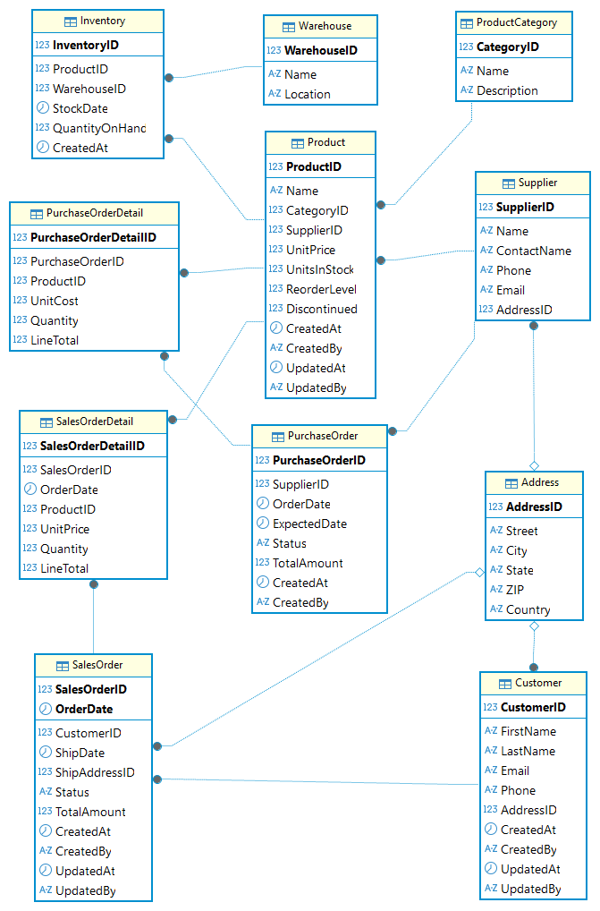
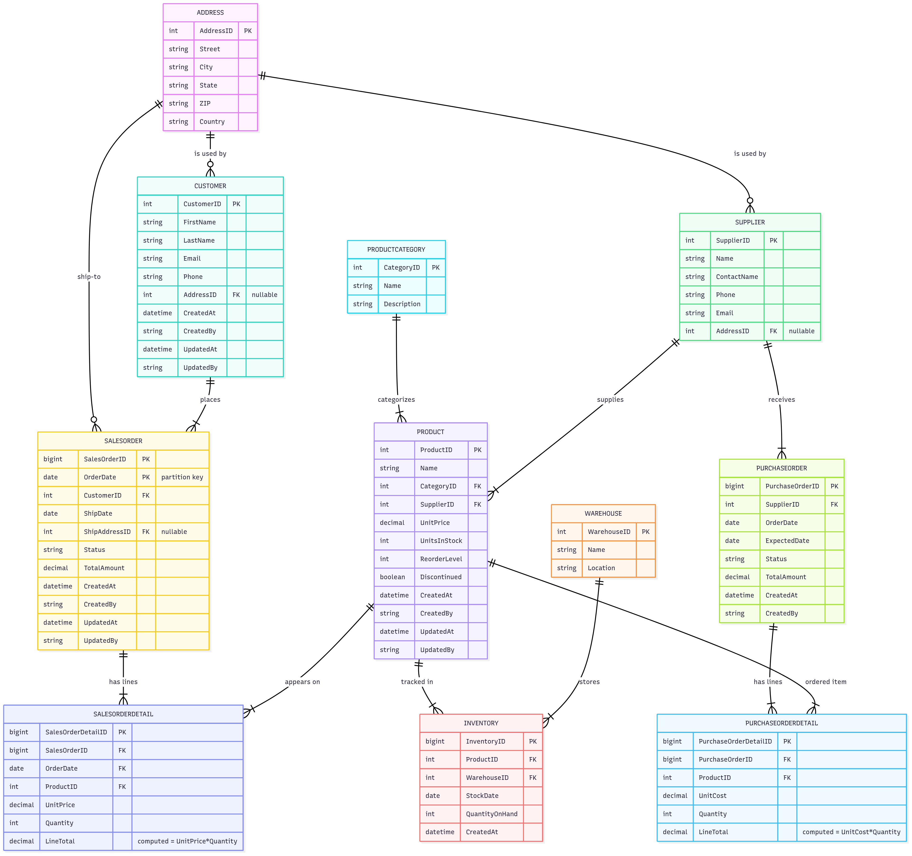

# SQL Server Tutorial

&copy; TINITIATE.COM

# Retail Company Data Model
This model supports core retail operations: customers and addresses, catalog (categories, suppliers, products), inventory across warehouses, sales orders with line items, and procurement via purchase orders.  
- **Customer, Address** capture buyer and shipping details.  
- **ProductCategory, Supplier, Product** define the merchandise master.  
- **Warehouse, Inventory** track stock by site and date.  
- **SalesOrder, SalesOrderDetail** handle order capture (partitioned by order date).  
- **PurchaseOrder, PurchaseOrderDetail** manage replenishment from suppliers.  
Targeted nonclustered indexes optimize common filters (category, product/date, customer/date, status).



## Customer
* **CustomerID**: Surrogate key (PK).  
* **FirstName, LastName, Email, Phone**: Customer identity and contact.  
* **AddressID**: FK → `Address(AddressID)` (shipping/billing address).  
* **CreatedAt/By, UpdatedAt/By**: Audit columns.

## Address
* **AddressID**: Surrogate key (PK).  
* **Street, City, State, ZIP, Country**: Standard address fields.

## ProductCategory
* **CategoryID**: Surrogate key (PK).  
* **Name, Description**: Merchandise grouping.

## Supplier
* **SupplierID**: Surrogate key (PK).  
* **Name, ContactName, Phone, Email**: Vendor info.  
* **AddressID**: FK → `Address(AddressID)`.

## Product
* **ProductID**: Surrogate key (PK).  
* **Name**: Product title.  
* **CategoryID**: FK → `ProductCategory(CategoryID)`.  
* **SupplierID**: FK → `Supplier(SupplierID)`.  
* **UnitPrice, UnitsInStock, ReorderLevel, Discontinued**: Item economics & availability.  
* **CreatedAt/By, UpdatedAt/By**: Audit columns.  
* **IX_Prod_Category**: Speeds lookups by category.

## Warehouse
* **WarehouseID**: Surrogate key (PK).  
* **Name, Location**: Stocking point metadata.

## Inventory
* **InventoryID**: Surrogate key (PK).  
* **ProductID**: FK → `Product(ProductID)`.  
* **WarehouseID**: FK → `Warehouse(WarehouseID)`.  
* **StockDate, QuantityOnHand, CreatedAt**: Daily on-hand snapshot.  
* **IX_Inv_ProductDate**: Fast recent stock checks per product.

## SalesOrder (Partitioned)
* **SalesOrderID, OrderDate**: Composite PK; partitioned by `OrderDate` (e.g., `PS_SalesYear`).  
* **CustomerID**: FK → `Customer(CustomerID)`.  
* **ShipDate, ShipAddressID**: Optional ship info (FK → `Address`).  
* **Status, TotalAmount, Created*/Updated***: Order lifecycle & audit.  
* **IX_SO_CustDate**: Customer order history by date.  
* **IX_SO_Status**: Filter by status; includes `TotalAmount`.

## SalesOrderDetail
* **SalesOrderDetailID**: Surrogate key (PK).  
* **SalesOrderID**: FK → `SalesOrder(SalesOrderID)`.  
* **ProductID**: FK → `Product(ProductID)`.  
* **UnitPrice, Quantity, LineTotal (computed)**: Line economics.  
* **IX_SOD_Product**: Product-level line lookups.

## PurchaseOrder
* **PurchaseOrderID**: Surrogate key (PK).  
* **SupplierID**: FK → `Supplier(SupplierID)`.  
* **OrderDate, ExpectedDate, Status, TotalAmount, CreatedAt/By**: PO lifecycle.  
* **IX_PO_SuppDate**: Supplier history by date.

## PurchaseOrderDetail
* **PurchaseOrderDetailID**: Surrogate key (PK).  
* **PurchaseOrderID**: FK → `PurchaseOrder(PurchaseOrderID)`.  
* **ProductID**: FK → `Product(ProductID)`.  
* **UnitCost, Quantity, LineTotal (computed)**: PO line economics.



## DDL Syntax
```sql
-- Create 'retail_company' schema
CREATE SCHEMA retail_company;

-- Create 'PS_SalesYear' partition scheme
IF NOT EXISTS (SELECT 1 FROM sys.partition_functions WHERE name = 'PS_SalesYear')
BEGIN
  EXEC('CREATE PARTITION FUNCTION PS_SalesYear (date)
        AS RANGE RIGHT FOR VALUES (''2023-01-01'',''2024-01-01'',''2025-01-01'',''2026-01-01'',''2027-01-01'');');
END;
IF NOT EXISTS (SELECT 1 FROM sys.partition_schemes WHERE name = 'PS_SalesYear')
BEGIN
  EXEC('CREATE PARTITION SCHEME PS_SalesYear
        AS PARTITION PS_SalesYear
        ALL TO ([PRIMARY]);');
END;

-- Create 'Address' table
CREATE TABLE retail_company.Address
(
  AddressID    INT           IDENTITY(1,1),
  Street       NVARCHAR(150) NOT NULL,
  City         NVARCHAR(50)  NOT NULL,
  State        NVARCHAR(50)  NOT NULL,
  ZIP          NVARCHAR(15)  NOT NULL,
  Country      NVARCHAR(50)  NOT NULL
);
ALTER TABLE retail_company.Address
  ADD CONSTRAINT PK_Address PRIMARY KEY CLUSTERED (AddressID);

-- Create 'Customer' table
CREATE TABLE retail_company.Customer
(
  CustomerID     INT           IDENTITY(1,1),
  FirstName      NVARCHAR(50)  NOT NULL,
  LastName       NVARCHAR(50)  NOT NULL,
  Email          VARCHAR(100)  NULL,
  Phone          VARCHAR(20)   NULL,
  AddressID      INT           NULL,
  CreatedAt      DATETIME2     NOT NULL DEFAULT SYSUTCDATETIME(),
  CreatedBy      SYSNAME       NOT NULL DEFAULT SUSER_SNAME(),
  UpdatedAt      DATETIME2     NOT NULL DEFAULT SYSUTCDATETIME(),
  UpdatedBy      SYSNAME       NOT NULL DEFAULT SUSER_SNAME()
);
ALTER TABLE retail_company.Customer
  ADD CONSTRAINT PK_Customer PRIMARY KEY CLUSTERED (CustomerID);
ALTER TABLE retail_company.Customer
  ADD CONSTRAINT FK_Cust_Address
      FOREIGN KEY (AddressID)
      REFERENCES retail_company.Address(AddressID);

-- Create 'Warehouse' table
CREATE TABLE retail_company.Warehouse
(
  WarehouseID   INT           IDENTITY(1,1),
  Name          NVARCHAR(100) NOT NULL,
  Location      NVARCHAR(100) NULL
);
ALTER TABLE retail_company.Warehouse
  ADD CONSTRAINT PK_Warehouse PRIMARY KEY CLUSTERED (WarehouseID);

-- Create 'ProductCategory' table
CREATE TABLE retail_company.ProductCategory
(
  CategoryID   INT           IDENTITY(1,1),
  Name         NVARCHAR(100) NOT NULL,
  Description  NVARCHAR(255) NULL
);
ALTER TABLE retail_company.ProductCategory
  ADD CONSTRAINT PK_ProductCategory PRIMARY KEY CLUSTERED (CategoryID);

-- Create 'Supplier' table
CREATE TABLE retail_company.Supplier
(
  SupplierID    INT           IDENTITY(1,1),
  Name          NVARCHAR(150) NOT NULL,
  ContactName   NVARCHAR(100) NULL,
  Phone         VARCHAR(20)   NULL,
  Email         VARCHAR(100)  NULL,
  AddressID     INT           NULL
);
ALTER TABLE retail_company.Supplier
  ADD CONSTRAINT PK_Supplier PRIMARY KEY CLUSTERED (SupplierID);
ALTER TABLE retail_company.Supplier
  ADD CONSTRAINT FK_Supp_Address
      FOREIGN KEY (AddressID)
      REFERENCES retail_company.Address(AddressID);

-- Create 'Product' table
CREATE TABLE retail_company.Product
(
  ProductID      INT           IDENTITY(1,1),
  Name           NVARCHAR(200) NOT NULL,
  CategoryID     INT           NOT NULL,
  SupplierID     INT           NOT NULL,
  UnitPrice      DECIMAL(18,2) NOT NULL,
  UnitsInStock   INT           NOT NULL DEFAULT 0,
  ReorderLevel   INT           NOT NULL DEFAULT 0,
  Discontinued   BIT           NOT NULL DEFAULT 0,
  CreatedAt      DATETIME2     NOT NULL DEFAULT SYSUTCDATETIME(),
  CreatedBy      SYSNAME       NOT NULL DEFAULT SUSER_SNAME(),
  UpdatedAt      DATETIME2     NOT NULL DEFAULT SYSUTCDATETIME(),
  UpdatedBy      SYSNAME       NOT NULL DEFAULT SUSER_SNAME()
);
ALTER TABLE retail_company.Product
  ADD CONSTRAINT PK_Product PRIMARY KEY CLUSTERED (ProductID);
ALTER TABLE retail_company.Product
  ADD CONSTRAINT FK_Prod_Category
      FOREIGN KEY (CategoryID)
      REFERENCES retail_company.ProductCategory(CategoryID);
ALTER TABLE retail_company.Product
  ADD CONSTRAINT FK_Prod_Supplier
      FOREIGN KEY (SupplierID)
      REFERENCES retail_company.Supplier(SupplierID);
-- Create an index for 'Product' table
CREATE INDEX IX_Prod_Category
ON retail_company.Product(CategoryID);

-- Create 'Inventory' table
CREATE TABLE retail_company.Inventory
(
  InventoryID     BIGINT        IDENTITY(1,1),
  ProductID       INT           NOT NULL,
  WarehouseID     INT           NOT NULL,
  StockDate       DATE          NOT NULL,
  QuantityOnHand  INT           NOT NULL,
  CreatedAt       DATETIME2     NOT NULL DEFAULT SYSUTCDATETIME()
);
ALTER TABLE retail_company.Inventory
  ADD CONSTRAINT PK_Inventory PRIMARY KEY CLUSTERED (InventoryID);
ALTER TABLE retail_company.Inventory
  ADD CONSTRAINT FK_Inv_Product
      FOREIGN KEY (ProductID)
      REFERENCES retail_company.Product(ProductID);
ALTER TABLE retail_company.Inventory
  ADD CONSTRAINT FK_Inv_Warehouse
      FOREIGN KEY (WarehouseID)
      REFERENCES retail_company.Warehouse(WarehouseID);
-- Create an index for 'Inventory' table
CREATE INDEX IX_Inv_ProductDate
ON retail_company.Inventory(ProductID, StockDate DESC);

-- Create 'SalesOrder' table
CREATE TABLE retail_company.SalesOrder
(
  SalesOrderID   BIGINT        NOT NULL,
  CustomerID     INT           NOT NULL,
  OrderDate      DATE          NOT NULL,
  ShipDate       DATE          NULL,
  ShipAddressID  INT           NULL,
  Status         NVARCHAR(20)  NOT NULL,
  TotalAmount    DECIMAL(18,2) NOT NULL,
  CreatedAt      DATETIME2     NOT NULL DEFAULT SYSUTCDATETIME(),
  CreatedBy      SYSNAME       NOT NULL DEFAULT SUSER_SNAME(),
  UpdatedAt      DATETIME2     NOT NULL DEFAULT SYSUTCDATETIME(),
  UpdatedBy      SYSNAME       NOT NULL DEFAULT SUSER_SNAME()
);
ALTER TABLE retail_company.SalesOrder
  ADD CONSTRAINT PK_SalesOrder
      PRIMARY KEY CLUSTERED (SalesOrderID, OrderDate)
      ON PS_SalesYear(OrderDate);
ALTER TABLE retail_company.SalesOrder
  ADD CONSTRAINT FK_SO_Customer
      FOREIGN KEY (CustomerID)
      REFERENCES retail_company.Customer(CustomerID);
ALTER TABLE retail_company.SalesOrder
  ADD CONSTRAINT FK_SO_ShipAddr
      FOREIGN KEY (ShipAddressID)
      REFERENCES retail_company.Address(AddressID);
-- Create an index for 'SalesOrder' table
CREATE INDEX IX_SO_CustDate
  ON retail_company.SalesOrder(CustomerID, OrderDate DESC);
-- Create an index for 'SalesOrder' table
CREATE INDEX IX_SO_Status
  ON retail_company.SalesOrder(Status)
  INCLUDE (TotalAmount);

-- Create 'SalesOrderDetail' table
CREATE TABLE retail_company.SalesOrderDetail
(
  SalesOrderDetailID BIGINT    IDENTITY(1,1),
  SalesOrderID       BIGINT    NOT NULL,
  OrderDate      DATE          NOT NULL,
  ProductID          INT       NOT NULL,
  UnitPrice          DECIMAL(18,2) NOT NULL,
  Quantity           INT       NOT NULL,
  LineTotal          AS (UnitPrice * Quantity) PERSISTED
);
ALTER TABLE retail_company.SalesOrderDetail
  ADD CONSTRAINT PK_SalesOrderDetail PRIMARY KEY CLUSTERED (SalesOrderDetailID);
ALTER TABLE retail_company.SalesOrderDetail
  ADD CONSTRAINT FK_SOD_Order
      FOREIGN KEY (SalesOrderID, OrderDate)
      REFERENCES retail_company.SalesOrder(SalesOrderID, OrderDate);
ALTER TABLE retail_company.SalesOrderDetail
  ADD CONSTRAINT FK_SOD_Product
      FOREIGN KEY (ProductID)
      REFERENCES retail_company.Product(ProductID);
-- Create an index for 'SalesOrderDetail' table
CREATE INDEX IX_SOD_Product
ON retail_company.SalesOrderDetail(ProductID);

-- Create 'PurchaseOrder' table
CREATE TABLE retail_company.PurchaseOrder
(
  PurchaseOrderID  BIGINT       IDENTITY(1,1),
  SupplierID       INT          NOT NULL,
  OrderDate        DATE         NOT NULL,
  ExpectedDate     DATE         NULL,
  Status           NVARCHAR(20) NOT NULL,
  TotalAmount      DECIMAL(18,2)NOT NULL,
  CreatedAt        DATETIME2    NOT NULL DEFAULT SYSUTCDATETIME(),
  CreatedBy        SYSNAME      NOT NULL DEFAULT SUSER_SNAME()
);
ALTER TABLE retail_company.PurchaseOrder
  ADD CONSTRAINT PK_PurchaseOrder PRIMARY KEY CLUSTERED (PurchaseOrderID);
ALTER TABLE retail_company.PurchaseOrder
  ADD CONSTRAINT FK_PO_Supplier
      FOREIGN KEY (SupplierID)
      REFERENCES retail_company.Supplier(SupplierID);
-- Create an index for 'PurchaseOrder' table
CREATE INDEX IX_PO_SuppDate
ON retail_company.PurchaseOrder(SupplierID, OrderDate DESC);

-- Create 'PurchaseOrderDetail' table
CREATE TABLE retail_company.PurchaseOrderDetail
(
  PurchaseOrderDetailID BIGINT IDENTITY(1,1),
  PurchaseOrderID       BIGINT NOT NULL,
  ProductID             INT    NOT NULL,
  UnitCost              DECIMAL(18,2) NOT NULL,
  Quantity              INT    NOT NULL,
  LineTotal             AS (UnitCost * Quantity) PERSISTED
);
ALTER TABLE retail_company.PurchaseOrderDetail
  ADD CONSTRAINT PK_PurchaseOrderDetail PRIMARY KEY CLUSTERED (PurchaseOrderDetailID);
ALTER TABLE retail_company.PurchaseOrderDetail
  ADD CONSTRAINT FK_POD_PO
      FOREIGN KEY (PurchaseOrderID)
      REFERENCES retail_company.PurchaseOrder(PurchaseOrderID);
ALTER TABLE retail_company.PurchaseOrderDetail
  ADD CONSTRAINT FK_POD_Product
      FOREIGN KEY (ProductID)
      REFERENCES retail_company.Product(ProductID);
```

## DML Syntax
```sql
/* ===================================================================
   RETAIL COMPANY – BULK DATA GENERATOR (contained-DB safe)
   Prereq: Your retail_company tables + PS_SalesYear already exist.
   ===================================================================*/
SET NOCOUNT ON;

-----------------------------------------------------------------------
-- Tunables
-----------------------------------------------------------------------
DECLARE
  @addrCount            int = 200,
  @warehouseCount       int = 5,
  @categoryCount        int = 8,
  @supplierCount        int = 40,
  @productCount         int = 200,
  @customerCount        int = 600,

  @inventoryDays        int = 7,
  @inventoryProducts    int = 50,
  @inventoryWarehouses  int = 4,

  @salesOrderCount      int = 1500,
  @avgLinesPerOrder     int = 2,

  @purchaseOrderCount   int = 400,
  @avgLinesPerPO        int = 2;

DECLARE
  @startDate date = '2025-07-01',
  @endDate   date = '2025-07-31'; -- keep within your partition ranges

-----------------------------------------------------------------------
-- 1) Address
-----------------------------------------------------------------------
;WITH bn_addr AS (
  SELECT ROW_NUMBER() OVER (ORDER BY (SELECT NULL)) AS n
  FROM sys.objects a CROSS JOIN sys.objects b CROSS JOIN sys.objects c
)
INSERT INTO retail_company.Address (Street, City, State, ZIP, Country)
SELECT
  CONCAT('No.', N.n, ' ',
         CASE (N.n%5) WHEN 0 THEN 'Main' WHEN 1 THEN 'Oak' WHEN 2 THEN 'Maple'
                      WHEN 3 THEN 'Pine' ELSE 'Cedar' END,
         ' St'),
  CONCAT('City', N.n % 300),
  CONCAT('State', N.n % 50),
  CONCAT('Z', RIGHT('00000'+CONVERT(varchar(8), 10000 + (N.n%90000)), 5)),
  CASE N.n%7
    WHEN 0 THEN 'USA' WHEN 1 THEN 'India' WHEN 2 THEN 'UK'
    WHEN 3 THEN 'Germany' WHEN 4 THEN 'Brazil' WHEN 5 THEN 'Canada' ELSE 'Australia' END
FROM bn_addr AS N
WHERE N.n <= @addrCount;

DECLARE @addrMax int = (SELECT MAX(AddressID) FROM retail_company.Address);

-----------------------------------------------------------------------
-- 2) Warehouse
-----------------------------------------------------------------------
;WITH bn_wh AS (
  SELECT ROW_NUMBER() OVER (ORDER BY (SELECT NULL)) AS n
  FROM sys.objects a CROSS JOIN sys.objects b
)
INSERT INTO retail_company.Warehouse (Name, Location)
SELECT
  CONCAT('WH-', RIGHT('000'+CONVERT(varchar(10), N.n), 3)),
  CONCAT('Zone-', CHAR(65 + (N.n%5)))
FROM bn_wh AS N
WHERE N.n <= @warehouseCount;

-----------------------------------------------------------------------
-- 3) ProductCategory
-----------------------------------------------------------------------
;WITH bn_cat AS (
  SELECT ROW_NUMBER() OVER (ORDER BY (SELECT NULL)) AS n
  FROM sys.objects a CROSS JOIN sys.objects b
)
INSERT INTO retail_company.ProductCategory (Name, Description)
SELECT
  CONCAT('Category-', RIGHT('000'+CONVERT(varchar(10), N.n),3)),
  CONCAT('Assorted goods for segment ', N.n)
FROM bn_cat AS N
WHERE N.n <= @categoryCount;

-----------------------------------------------------------------------
-- 4) Supplier
-----------------------------------------------------------------------
;WITH bn_sup AS (
  SELECT ROW_NUMBER() OVER (ORDER BY (SELECT NULL)) AS n
  FROM sys.objects a CROSS JOIN sys.objects b
)
INSERT INTO retail_company.Supplier (Name, ContactName, Phone, Email, AddressID)
SELECT
  CONCAT('Supplier ', N.n),
  CONCAT('Contact ', N.n),
  CONCAT('+1-555-', RIGHT('0000'+CONVERT(varchar(10), 2000+(N.n%8000)),4)),
  CONCAT('supplier', N.n, '@example.com'),
  ((N.n-1)%@addrMax)+1
FROM bn_sup AS N
WHERE N.n <= @supplierCount;

DECLARE @supMax int = (SELECT MAX(SupplierID) FROM retail_company.Supplier);

-----------------------------------------------------------------------
-- 5) Customer
-----------------------------------------------------------------------
;WITH bn_cust AS (
  SELECT ROW_NUMBER() OVER (ORDER BY (SELECT NULL)) AS n
  FROM sys.objects a CROSS JOIN sys.objects b CROSS JOIN sys.objects c
)
INSERT INTO retail_company.Customer (FirstName, LastName, Email, Phone, AddressID)
SELECT
  CONCAT('First', N.n),
  CONCAT('Last', N.n),
  CONCAT('customer', N.n, '@email.com'),
  CONCAT('+1-444-', RIGHT('0000'+CONVERT(varchar(10), 3000+(N.n%8000)),4)),
  ((N.n*7-3)%@addrMax)+1
FROM bn_cust AS N
WHERE N.n <= @customerCount;

DECLARE @custMax int = (SELECT MAX(CustomerID) FROM retail_company.Customer);

-----------------------------------------------------------------------
-- 6) Product
-----------------------------------------------------------------------
DECLARE @catMax int = (SELECT MAX(CategoryID) FROM retail_company.ProductCategory);

;WITH bn_prod AS (
  SELECT ROW_NUMBER() OVER (ORDER BY (SELECT NULL)) AS n
  FROM sys.objects a CROSS JOIN sys.objects b CROSS JOIN sys.objects c
)
INSERT INTO retail_company.Product
  (Name, CategoryID, SupplierID, UnitPrice, UnitsInStock, ReorderLevel, Discontinued)
SELECT
  CONCAT('Product-', RIGHT('000000'+CONVERT(varchar(10), N.n),6)),
  ((N.n-1)%@catMax)+1,
  ((N.n*11-5)%@supMax)+1,
  CAST( (5 + (N.n%400)) + ((N.n%99)*0.11) AS decimal(18,2) ),
  50 + (N.n % 500),
  20 + (N.n % 80),
  CASE N.n%40 WHEN 0 THEN 1 ELSE 0 END
FROM bn_prod AS N
WHERE N.n <= @productCount;

DECLARE @prodMax int = (SELECT MAX(ProductID) FROM retail_company.Product);

-----------------------------------------------------------------------
-- 7) Inventory snapshots (subset of warehouses × products × days)
-----------------------------------------------------------------------
IF OBJECT_ID('tempdb..#InvWarehouses') IS NOT NULL DROP TABLE #InvWarehouses;
IF OBJECT_ID('tempdb..#InvProducts')   IS NOT NULL DROP TABLE #InvProducts;

;WITH rankedW AS (
  SELECT WarehouseID, ROW_NUMBER() OVER (ORDER BY WarehouseID) AS rn
  FROM retail_company.Warehouse
)
SELECT WarehouseID
INTO #InvWarehouses
FROM rankedW
WHERE rn <= @inventoryWarehouses;

;WITH rankedP AS (
  SELECT ProductID, ROW_NUMBER() OVER (ORDER BY ProductID) AS rn
  FROM retail_company.Product
)
SELECT ProductID
INTO #InvProducts
FROM rankedP
WHERE rn <= @inventoryProducts;

;WITH nums_days AS (
  SELECT ROW_NUMBER() OVER (ORDER BY (SELECT NULL)) AS n
  FROM sys.objects a CROSS JOIN sys.objects b
),
days AS (
  SELECT DATEADD(DAY, n-1, @startDate) AS d
  FROM nums_days
  WHERE n <= @inventoryDays
)
INSERT INTO retail_company.Inventory (ProductID, WarehouseID, StockDate, QuantityOnHand)
SELECT
  p.ProductID,
  w.WarehouseID,
  d.d,
  100 + (ABS(CHECKSUM(NEWID())) % 9000)
FROM #InvWarehouses w
CROSS JOIN #InvProducts p
CROSS JOIN days d;

-----------------------------------------------------------------------
-- 8) SalesOrder (capture to #SalesOrders for details)
-----------------------------------------------------------------------
IF OBJECT_ID('tempdb..#SalesOrders') IS NOT NULL DROP TABLE #SalesOrders;
CREATE TABLE #SalesOrders (
  SalesOrderID bigint NOT NULL,
  OrderDate    date   NOT NULL,
  CustomerID   int    NOT NULL,
  PRIMARY KEY CLUSTERED (SalesOrderID, OrderDate)  -- unnamed PK (contained DB safe)
);

;WITH bn_so AS (
  SELECT ROW_NUMBER() OVER (ORDER BY (SELECT NULL)) AS rn
  FROM sys.objects a CROSS JOIN sys.objects b CROSS JOIN sys.objects c
)
INSERT INTO retail_company.SalesOrder
  (SalesOrderID, CustomerID, OrderDate, ShipDate, ShipAddressID, Status, TotalAmount)
OUTPUT INSERTED.SalesOrderID, INSERTED.OrderDate, INSERTED.CustomerID
  INTO #SalesOrders(SalesOrderID, OrderDate, CustomerID)
SELECT
  4000000 + N.rn AS SalesOrderID,
  ((N.rn*7-3) % @custMax) + 1 AS CustomerID,
  DATEADD(DAY, N.rn % DATEDIFF(DAY, @startDate, DATEADD(DAY,1,@endDate)), @startDate) AS OrderDate,
  CASE WHEN N.rn%3=0 THEN NULL
       ELSE DATEADD(DAY, 1 + (N.rn%5),
                    DATEADD(DAY, N.rn % DATEDIFF(DAY, @startDate, DATEADD(DAY,1,@endDate)), @startDate)) END AS ShipDate,
  ((N.rn*13-7)%@addrMax)+1 AS ShipAddressID,
  CASE N.rn%6 WHEN 0 THEN N'Open' WHEN 1 THEN N'Open'
              WHEN 2 THEN N'Shipped' WHEN 3 THEN N'Shipped'
              WHEN 4 THEN N'Cancelled' ELSE N'Open' END AS Status,
  CAST( (50 + (N.rn % 450)) * (5 + (N.rn % 40)) AS decimal(18,2)) AS TotalAmount
FROM bn_so AS N
WHERE N.rn <= @salesOrderCount;

-----------------------------------------------------------------------
-- 9) SalesOrderDetail (1..@avgLinesPerOrder per order)
-----------------------------------------------------------------------
;WITH BaseSO AS (
  SELECT so.SalesOrderID, so.OrderDate,
         ROW_NUMBER() OVER (ORDER BY so.SalesOrderID, so.OrderDate) AS so_rn
  FROM #SalesOrders so
),
LineCountsSO AS (
  SELECT
    b.SalesOrderID,
    b.OrderDate,
    1 + ABS(CHECKSUM(b.so_rn, NEWID())) % @avgLinesPerOrder AS lineCount
  FROM BaseSO b
),
NumsSO AS (
  SELECT ROW_NUMBER() OVER (ORDER BY (SELECT NULL)) AS n
  FROM sys.objects a CROSS JOIN sys.objects b
),
ExplodedSO AS (
  SELECT lc.SalesOrderID, lc.OrderDate, n.n AS line_num
  FROM LineCountsSO lc
  JOIN NumsSO n
    ON n.n <= lc.lineCount
),
ChosenProductsSO AS (
  SELECT e.SalesOrderID, e.OrderDate, e.line_num,
         ((ABS(CHECKSUM(e.SalesOrderID, e.OrderDate, e.line_num, 12345)) % @prodMax) + 1) AS ProductID
  FROM ExplodedSO e
)
INSERT INTO retail_company.SalesOrderDetail (SalesOrderID, OrderDate, ProductID, UnitPrice, Quantity)
SELECT
  cp.SalesOrderID,
  cp.OrderDate,
  cp.ProductID,
  p.UnitPrice,
  1 + ABS(CHECKSUM(cp.SalesOrderID, cp.OrderDate, cp.line_num)) % 7 AS Quantity
FROM ChosenProductsSO cp
JOIN retail_company.Product p
  ON p.ProductID = cp.ProductID;

-----------------------------------------------------------------------
-- 10) PurchaseOrder (capture IDs)
-----------------------------------------------------------------------
IF OBJECT_ID('tempdb..#PO') IS NOT NULL DROP TABLE #PO;
CREATE TABLE #PO (
  PurchaseOrderID bigint PRIMARY KEY  -- unnamed PK (contained DB safe)
);

;WITH bn_po AS (
  SELECT ROW_NUMBER() OVER (ORDER BY (SELECT NULL)) AS rn
  FROM sys.objects a CROSS JOIN sys.objects b CROSS JOIN sys.objects c
)
INSERT INTO retail_company.PurchaseOrder
  (SupplierID, OrderDate, ExpectedDate, Status, TotalAmount)
OUTPUT INSERTED.PurchaseOrderID INTO #PO(PurchaseOrderID)
SELECT
  ((N.rn*5-1)%@supMax)+1 AS SupplierID,
  DATEADD(DAY, N.rn % DATEDIFF(DAY, @startDate, DATEADD(DAY,1,@endDate)), @startDate) AS OrderDate,
  DATEADD(DAY, 3 + (N.rn%10),
          DATEADD(DAY, N.rn % DATEDIFF(DAY, @startDate, DATEADD(DAY,1,@endDate)), @startDate)) AS ExpectedDate,
  CASE N.rn%5 WHEN 0 THEN N'Open' WHEN 1 THEN N'Placed' WHEN 2 THEN N'Placed'
              WHEN 3 THEN N'Received' ELSE N'Open' END AS Status,
  CAST( (200 + (N.rn % 8000)) * 1.00 AS decimal(18,2)) AS TotalAmount
FROM bn_po AS N
WHERE N.rn <= @purchaseOrderCount;

-----------------------------------------------------------------------
-- 11) PurchaseOrderDetail (1..@avgLinesPerPO per PO)
-----------------------------------------------------------------------
;WITH BasePO AS (
  SELECT p.PurchaseOrderID,
         ROW_NUMBER() OVER (ORDER BY p.PurchaseOrderID) AS rn
  FROM #PO p
),
LineCountsPO AS (
  SELECT
    b.PurchaseOrderID,
    1 + ABS(CHECKSUM(b.rn, NEWID())) % @avgLinesPerPO AS lineCount
  FROM BasePO b
),
NumsPO AS (
  SELECT ROW_NUMBER() OVER (ORDER BY (SELECT NULL)) AS n
  FROM sys.objects a CROSS JOIN sys.objects b
),
ExplodedPO AS (
  SELECT lc.PurchaseOrderID, n.n AS line_num
  FROM LineCountsPO lc
  JOIN NumsPO n
    ON n.n <= lc.lineCount
),
POProducts AS (
  SELECT e.PurchaseOrderID, e.line_num,
         ((ABS(CHECKSUM(e.PurchaseOrderID, e.line_num, 67890)) % @prodMax) + 1) AS ProductID
  FROM ExplodedPO e
)
INSERT INTO retail_company.PurchaseOrderDetail (PurchaseOrderID, ProductID, UnitCost, Quantity)
SELECT
  pp.PurchaseOrderID,
  pp.ProductID,
  CAST(p.UnitPrice * (0.6 + (ABS(CHECKSUM(pp.PurchaseOrderID, pp.line_num)) % 50)/100.0) AS decimal(18,2)) AS UnitCost,
  10 + (ABS(CHECKSUM(pp.PurchaseOrderID, pp.line_num, NEWID())) % 90) AS Quantity
FROM POProducts pp
JOIN retail_company.Product p
  ON p.ProductID = pp.ProductID;

-----------------------------------------------------------------------
-- Done: quick row counts
-----------------------------------------------------------------------
PRINT '=== RETAIL BULK LOAD COMPLETE ===';
SELECT
  (SELECT COUNT(*) FROM retail_company.Address)             AS AddressCount,
  (SELECT COUNT(*) FROM retail_company.Warehouse)           AS WarehouseCount,
  (SELECT COUNT(*) FROM retail_company.ProductCategory)     AS ProductCategoryCount,
  (SELECT COUNT(*) FROM retail_company.Supplier)            AS SupplierCount,
  (SELECT COUNT(*) FROM retail_company.Product)             AS ProductCount,
  (SELECT COUNT(*) FROM retail_company.Inventory)           AS InventoryCount,
  (SELECT COUNT(*) FROM retail_company.Customer)            AS CustomerCount,
  (SELECT COUNT(*) FROM retail_company.SalesOrder)          AS SalesOrderCount,
  (SELECT COUNT(*) FROM retail_company.SalesOrderDetail)    AS SalesOrderDetailCount,
  (SELECT COUNT(*) FROM retail_company.PurchaseOrder)       AS PurchaseOrderCount,
  (SELECT COUNT(*) FROM retail_company.PurchaseOrderDetail) AS PurchaseOrderDetailCount;
```

## DROP Syntax
```sql
DROP TABLE IF EXISTS retail_company.PurchaseOrderDetail;
DROP TABLE IF EXISTS retail_company.PurchaseOrder;
DROP TABLE IF EXISTS retail_company.SalesOrderDetail;
DROP TABLE IF EXISTS retail_company.SalesOrder;

DROP TABLE IF EXISTS retail_company.Inventory;
DROP TABLE IF EXISTS retail_company.Product;
DROP TABLE IF EXISTS retail_company.Supplier;
DROP TABLE IF EXISTS retail_company.ProductCategory;
DROP TABLE IF EXISTS retail_company.Warehouse;

DROP TABLE IF EXISTS retail_company.Customer;
DROP TABLE IF EXISTS retail_company.Address;

DROP PARTITION SCHEME PS_SalesYear;
DROP PARTITION FUNCTION PS_SalesYear;

DROP SCHEMA retail_company;
```

***
| &copy; TINITIATE.COM |
|----------------------|
