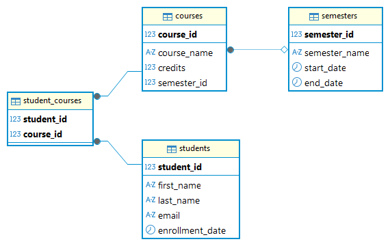

# SQL Server Tutorial
&copy; TINITIATE.COM

##### [Back To Contents](../README.md)

# Student Courses Data Model
The Student Courses Data Model organizes academic offerings and enrollments across four related tables. The `Semesters` table defines each academic term with its name and date range, while the `Courses` table lists every course—its title, credit value, and the semester in which it’s offered. The `Students` table captures each learner’s identity, contact information, and enrollment date. Finally, the `Student_Courses` junction table ties students to their chosen courses, enforcing a many-to-many relationship and ensuring that each student-course pairing is unique.



## Semesters Table 
* **semester_id**: A unique identifier for each semester. It is the primary key of the table.
* **semester_name**: The name of the semester, such as "Fall 2023" or "Spring 2024".
* **start_date**: The start date of the semester.
* **end_date**: The end date of the semester.
## Courses Table
* **course_id**: A unique identifier for each course. It is the primary key of the table.
* **course_name**: The name of the course, such as "Introduction to Computer Science" or "Calculus I".
* **credits**: The number of credits the course is worth.
* **semester_id**: A foreign key that references the semester_id in the semesters table. It indicates which semester the course is offered in.
## Students Table
* **student_id**: A unique identifier for each student. It is the primary key of the table.
* **first_name**: The first name of the student.
* **last_name**: The last name of the student.
* **email**: The email address of the student. It is unique for each student.
* **enrollment_date**: The date when the student enrolled.
## Student_Courses Table
* **student_id**: A foreign key that references the student_id in the students table. It indicates which student is enrolled in the course.
* **course_id**: A foreign key that references the course_id in the courses table. It indicates which course the student is enrolled in.
* The combination of student_id and course_id forms the primary key of the table, ensuring that each student-course pair is unique.
* The student_courses table is a junction table that represents a many-to-many relationship between students and courses. 
* A student can be enrolled in multiple courses, and a course can have multiple students enrolled in it.
 
## DDL Syntax
```sql
-- Create 'student_courses' schema
CREATE SCHEMA student_courses;

-- Create 'semesters' table
CREATE TABLE student_courses.semesters (
    semester_id INT PRIMARY KEY,
    semester_name VARCHAR(50) NOT NULL,
    start_date DATE NOT NULL,
    end_date DATE NOT NULL
);

-- Create 'courses' table
CREATE TABLE student_courses.courses (
    course_id INT PRIMARY KEY,
    course_name VARCHAR(100) NOT NULL,
    credits INT NOT NULL,
    semester_id INT,
    FOREIGN KEY (semester_id) REFERENCES student_courses.semesters(semester_id)
);

-- Create 'students' table
CREATE TABLE student_courses.students (
    student_id INT PRIMARY KEY,
    first_name VARCHAR(50) NOT NULL,
    last_name VARCHAR(50) NOT NULL,
    email VARCHAR(100) UNIQUE,
    enrollment_date DATE NOT NULL
);

-- Create 'student_courses' table to represent many-to-many relationship between students and courses
CREATE TABLE student_courses.student_courses (
    student_id INT,
    course_id INT,
    FOREIGN KEY (student_id) REFERENCES student_courses.students(student_id),
    FOREIGN KEY (course_id) REFERENCES student_courses.courses(course_id),
    PRIMARY KEY (student_id, course_id)
);
```

## DML Syntax
```sql 
-- Insert records into 'semesters'
INSERT INTO student_courses.semesters (semester_id, semester_name, start_date, end_date)
VALUES
    (1, 'Fall 2023', '2023-09-01', '2023-12-15'),
    (2, 'Spring 2024', '2024-01-15', '2024-05-15'),
    (3, 'Summer 2024', '2024-06-01', '2024-08-15'),
    (4, 'Fall 2024', '2024-09-01', '2024-12-15'),
    (5, 'Spring 2025', '2025-01-15', '2025-05-15'),
    (6, 'Summer 2025', '2025-06-01', '2025-08-15'),
    (7, 'Fall 2025', '2025-09-01', '2025-12-15'),
    (8, 'Spring 2026', '2026-01-15', '2026-05-15');

-- Insert records into 'courses'
INSERT INTO student_courses.courses (course_id, course_name, credits, semester_id)
VALUES
    (1, 'Introduction to Computer Science', 4, 1),
    (2, 'Calculus I', 3, 1),
    (3, 'English Composition', 3, 2),
    (4, 'Introduction to Psychology', 3, 3),
    (5, 'World History', 3, 4),
    (6,  'Data Structures', 4,  2),
    (7,  'Algorithms', 4,  2),
    (8,  'Operating Systems', 3,  3),
    (9,  'Database Systems', 4,  4),
    (10, 'Computer Networks', 3,  5),
    (11, 'Software Engineering', 3,  6),
    (12, 'Machine Learning', 4,  7),
    (13, 'Artificial Intelligence', 4,  8),
    (14, 'English Literature', 3,  3);

-- Insert records into 'students'
INSERT INTO student_courses.students (student_id, first_name, last_name, email, enrollment_date)
VALUES
    (1, 'John', 'Doe', 'john.doe@example.com', '2023-08-01'),
    (2, 'Jane', 'Smith', 'jane.smith@example.com', '2023-08-02'),
    (3, 'Michael', 'Johnson', 'michael.johnson@example.com', '2023-08-03'),
    (4, 'Emily', 'Davis', 'emily.davis@example.com', '2023-08-04'),
    (5, 'David', 'Wilson', 'david.wilson@example.com', '2023-08-05'),
    (6, 'Sarah', 'Taylor', 'sarah.taylor@example.com', '2023-08-06'),
    (7, 'James', 'Brown', 'james.brown@example.com', '2023-08-07'),
    (8, 'Jessica', 'Jones', 'jessica.jones@example.com', '2023-08-08'),
    (9, 'Chris', 'Miller', 'chris.miller@example.com', '2023-08-09'),
    (10, 'Amanda', 'Martinez', 'amanda.martinez@example.com', '2023-08-10'),
    (11,  'Liam', 'Anderson', 'liam.anderson@example.com', '2024-02-20'),
    (12,  'Olivia', 'Thomas', 'olivia.thomas@example.com', '2025-03-01'),
    (13,  'Noah', 'Lee', 'noah.lee@example.com', '2025-04-15'),
    (14,  'Emma', 'Martinez', 'emma.martinez@example.com', '2026-01-10'),
    (15,  'Ava', 'Garcia', 'ava.garcia@example.com', '2026-02-05'),
    (16,  'Ethan', 'Clark', 'ethan.clark@example.com', '2023-12-01'),
    (17,  'Mia', 'Rodriguez', 'mia.rodriguez@example.com', '2023-11-20'),
    (18,  'Mary ', 'O''Connor', 'mary.oconnor@example.com', '2024-10-10'),
    (19,  'William', 'Lewis', 'william.lewis@example.com', '2024-07-15'),
    (20,  'Sophia', 'Walker', 'sophia.walker@example.com', '2024-05-10');

-- Insert records into 'student_courses'
INSERT INTO student_courses.student_courses (student_id, course_id)
VALUES
    (1, 1),
    (2, 1),
    (3, 2),
    (4, 2),
    (5, 3),
    (6, 3),
    (7, 4),
    (8, 4),
    (9, 5),
    (10, 5),
    (11, 1),
    (11, 6),
    (12, 2),
    (12, 7),
    (13, 1),
    (13, 3),
    (13, 9),
    (14, 5),
    (14, 10),
    (15, 4),
    (15, 8),
    (16, 8),
    (17, 12),
    (17, 13),
    (18, 11), 
    (19, 6),
    (19, 7),
    (19, 8), 
    (20, 2),
    (20, 3);
```

***
### [Assignments](assignments/README.md)
### [Assignments - Solutions](assignments-solutions/README.md)

##### [Back To Contents](../README.md)
***
| &copy; TINITIATE.COM |
|----------------------|
