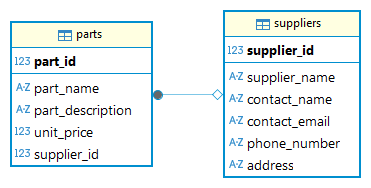

# SQL Server Tutorial
&copy; TINITIATE.COM

##### [Back To Contents](../README.md)

# Supplier Parts Data Model
The `suppliers` table stores information about the suppliers, including their contact details and address. The `parts` table stores information about the parts, including their description and price. The relationship between the two tables is established through the supplier_id foreign key in the parts table, which links each part to its supplier. This structure allows for easy retrieval of supplier information for each part.



## Suppliers Table
* **supplier_id**: A unique identifier for each supplier. It is the primary key of the table.
* **supplier_name**: The name of the supplier.
* **contact_name**: The name of the contact person at the supplier.
* **contact_email**: The email address of the contact person.
* **phone_number**: The phone number of the supplier.
* **address**: The physical address of the supplier.
## Parts Table
* **part_id**: A unique identifier for each part. It is the primary key of the table.
* **part_name**: The name of the part.
* **part_description**: A brief description of the part.
* **unit_price**: The price of the part per unit.
* **supplier_id**: A foreign key that references the supplier_id in the suppliers table. It indicates which supplier provides the part.

## DDL Syntax
```sql
-- Create 'supplier_parts' schema
CREATE SCHEMA supplier_parts;

-- Create 'suppliers' table
CREATE TABLE supplier_parts.suppliers (
    supplier_id INT PRIMARY KEY,
    supplier_name VARCHAR(100) NOT NULL,
    contact_name VARCHAR(100),
    contact_email VARCHAR(100),
    phone_number VARCHAR(20),
    address VARCHAR(200)
);

-- Create 'parts' table
CREATE TABLE supplier_parts.parts (
    part_id INT PRIMARY KEY,
    part_name VARCHAR(100) NOT NULL,
    part_description VARCHAR(200),
    unit_price DECIMAL(10, 2) NOT NULL,
    supplier_id INT,
    FOREIGN KEY (supplier_id) REFERENCES supplier_parts.suppliers(supplier_id)
);
```

## DML Syntax
```sql
-- Insert records into 'suppliers'
INSERT INTO suppliers (supplier_id, supplier_name, contact_name, contact_email, phone_number, address) VALUES
(1, 'Acme Corporation', 'John Doe', 'john.doe@acme.com', '123-456-7890', '123 Main St, Anytown, USA'),
(2, 'Global Parts Inc.', 'Jane Smith', 'jane.smith@globalparts.com', '234-567-8901', '456 Elm St, Anytown, USA'),
(3, 'Quality Supplies', 'Michael Johnson', 'michael.johnson@qualitysupplies.com', '345-678-9012', '789 Pine St, Anytown, USA'),
(4, 'Industrial Solutions', 'Emily Davis', 'emily.davis@industrialsolutions.com', '456-789-0123', '101 Oak St, Anytown, USA'),
(5, 'Precision Parts', 'David Wilson', 'david.wilson@precisionparts.com', '567-890-1234', '202 Maple St, Anytown, USA'),
(6, 'Tech Components', 'Sarah Taylor', 'sarah.taylor@techcomponents.com', '678-901-2345', '303 Cedar St, Anytown, USA'),
(7, 'Hardware Hub', 'James Brown', 'james.brown@hardwarehub.com', '789-012-3456', '404 Birch St, Anytown, USA'),
(8, 'Supply Chain Services', 'Jessica Jones', 'jessica.jones@supplychainservices.com', '890-123-4567', '505 Cherry St, Anytown, USA'),
(9, 'Component Central', 'Chris Miller', 'chris.miller@componentcentral.com', '901-234-5678', '606 Walnut St, Anytown, USA'),
(10, 'Material Masters', 'Amanda Martinez', 'amanda.martinez@materialmasters.com', '012-345-6789', '707 Spruce St, Anytown, USA');

-- Insert records into 'parts'
INSERT INTO parts (part_id, part_name, part_description, unit_price, supplier_id) VALUES
(1, 'Widget', 'A small widget', 10.99, 1),
(2, 'Gadget', 'A useful gadget', 15.99, 1),
(3, 'Thingamajig', 'A mysterious thingamajig', 12.49, 2),
(4, 'Doohickey', 'A handy doohickey', 8.99, 2),
(5, 'Whatchamacallit', 'An essential whatchamacallit', 14.99, 3),
(6, 'Gizmo', 'A high-tech gizmo', 19.99, 3),
(7, 'Contraption', 'A complex contraption', 17.49, 4),
(8, 'Device', 'A useful device', 11.99, 4),
(9, 'Apparatus', 'A scientific apparatus', 16.99, 5),
(10, 'Mechanism', 'A mechanical mechanism', 13.49, 5),
(11, 'Bracket', 'Metal mounting bracket', 5.50,  1),
(12, 'Valve', 'Flow control valve', 22.75, 2),
(13, 'Bolt (Large)', 'Heavy-duty hex bolt', 1.25,  3),
(14, 'Nut (Hex)', 'Standard hex nut', 0.10,  3),
(15, 'Bearing', 'Ball bearing', 3.99,  4),
(16, 'Gasket', 'Rubber gasket seal', 0.55,  5),
(17, 'Pipe', 'Steel pipe, 1m length', 12.00, 6),
(18, 'Hose', 'Flexible rubber hose', 7.25,  6),
(19, 'Filter', 'Air intake filter', 15.80, 7),
(20, 'Regulator', 'Pressure regulator', 18.90, 2),
(21, 'Switch', 'Toggle switch', 2.45,  8),
(22, 'Connector', 'Electrical connector', 0.75,  9),
(23, 'Resistor', '10kΩ resistor', 0.05,  10),
(24, 'Capacitor', '100 µF capacitor', 0.20,  10),
(25, 'Transistor', 'NPN transistor', 0.40,  9),
(26, 'Diode', '1N4148 signal diode', 0.07,  9),
(27, 'Fuse', '5 A fuse', 0.30,  8),
(28, 'Lever', 'Control lever arm', 4.50,  7),
(29, 'Shaft', 'Drive shaft', 25.00, 4),
(30, 'Gear', '20-tooth gear', 8.60,  4),
(31, 'Pulley', 'Timing pulley', 6.75,  5),
(32, 'Spring', 'Compression spring', 0.90,  5),
(33, 'Bushing', 'Bronze bushing', 2.15,  1),
(49, 'Tool', 'A versatile tool', 9.99, 10),
(50, 'Instrument', 'A precise instrument', 20.99, 10);
```

***
### [Assignments](assignments/README.md)
### [Assignments - Solutions](assignments-solutions/README.md)

##### [Back To Contents](../README.md)
***
| &copy; TINITIATE.COM |
|----------------------|
