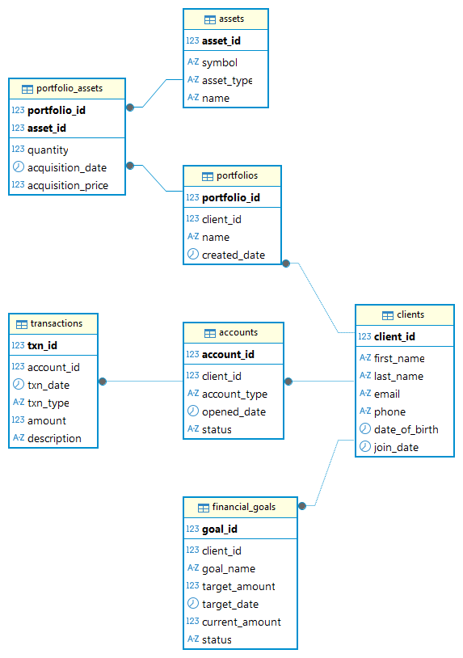

# SQL Server Tutorial

&copy; TINITIATE.COM

# Wealth Management Data Model
This Wealth Management model captures everything needed to support a full-service advisory platform: it begins by storing each client’s profile and contact details, then tracks all of the cash and investment accounts they hold. Clients can organize their holdings into named portfolios, and each portfolio links to specific financial assets (stocks, bonds, ETFs, etc.) along with purchase dates and prices. All cash movements and trades flow through a unified transactions ledger tied to the relevant account. Finally, the model includes financial goals—each with targets, deadlines and current progress—so advisors and clients can measure performance against personalized objectives. By weaving together clients, accounts, portfolios, assets, transactions and goals via carefully defined foreign‐key relationships, this schema enables rich analyses (e.g., performance attribution, goal‐tracking, cash flow reporting, and risk assessments) across the full spectrum of wealth management activities.



## Clients Table
* **client_id**: Unique identifier for each client (primary key).
* **first_name**, last_name: Client’s name.
* **email**: Unique contact email.
* **phone**: Contact phone number.
* **date_of_birth**: Client’s birth date.
* **join_date**: Date the client joined the platform.
## Accounts Table
* **account_id**: Unique identifier for each account (primary key).
* **client_id**: Foreign key → clients.client_id.
* **account_type**: e.g. “Checking”, “Savings”, “Brokerage”.
* **opened_date**: When the account was opened.
* **status**: e.g. “Active”, “Closed”.
## Portfolios Table
* **portfolio_id**: Unique identifier for each portfolio (primary key).
* **client_id**: Foreign key → clients.client_id.
* **name**: Custom name for the portfolio.
* **created_date**: When the portfolio was created.
## Assets Table
* **asset_id**: Unique identifier for each asset (primary key).
* **symbol**: Ticker or code (e.g. “AAPL”, “GOOG”).
* **asset_type**: e.g. “Stock”, “Bond”, “ETF”, “Mutual Fund”.
* **name**: Full asset name.
## Portfolio_Assets Table
* **portfolio_id**: Foreign key → portfolios.portfolio_id.
* **asset_id**: Foreign key → assets.asset_id.
* **quantity**: Units held.
* **acquisition_date**: Date purchased.
* **acquisition_price**: Price per unit at purchase.
* PRIMARY KEY (portfolio_id, asset_id).
## Transactions Table
* **txn_id**: Unique identifier for each transaction (primary key).
* **account_id**: Foreign key → accounts.account_id.
* **txn_date**: Date of transaction.
* **txn_type**: e.g. “Deposit”, “Withdrawal”, “Buy”, “Sell”.
* **amount**: Transaction amount (positive for credit, negative for debit).
* **description**: Optional notes.
## Financial_Goals Table
* **goal_id**: Unique identifier for each goal (primary key).
* **client_id**: Foreign key → clients.client_id.
* **goal_name**: e.g. “Retirement Fund”, “College Savings”.
* **target_amount**: Amount aimed for.
* **target_date**: Deadline for goal.
* **current_amount**: Amount saved so far.
* **status**: e.g. “In Progress”, “Achieved”, “Paused”.

## DDL Syntax
```sql
-- Create 'wealth_management' schema
CREATE SCHEMA wealth_management;

-- Create 'clients' table
CREATE TABLE wealth_management.clients (
  client_id       INT PRIMARY KEY,
  first_name      VARCHAR(50) NOT NULL,
  last_name       VARCHAR(50) NOT NULL,
  email           VARCHAR(100) UNIQUE NOT NULL,
  phone           VARCHAR(20),
  date_of_birth   DATE,
  join_date       DATE NOT NULL
);

-- Create 'accounts' table
CREATE TABLE wealth_management.accounts (
  account_id      INT PRIMARY KEY,
  client_id       INT NOT NULL,
  account_type    VARCHAR(20) NOT NULL,
  opened_date     DATE NOT NULL,
  status          VARCHAR(20) NOT NULL,
  FOREIGN KEY (client_id) REFERENCES wealth_management.clients(client_id)
);

-- Create 'portfolios' table
CREATE TABLE wealth_management.portfolios (
  portfolio_id    INT PRIMARY KEY,
  client_id       INT NOT NULL,
  name            VARCHAR(100),
  created_date    DATE NOT NULL,
  FOREIGN KEY (client_id) REFERENCES wealth_management.clients(client_id)
);

-- Create 'assets' table
CREATE TABLE wealth_management.assets (
  asset_id        INT PRIMARY KEY,
  symbol          VARCHAR(20) UNIQUE NOT NULL,
  asset_type      VARCHAR(20) NOT NULL,
  name            VARCHAR(100)
);

-- Create 'portfolio_assets' table
CREATE TABLE wealth_management.portfolio_assets (
  portfolio_id      INT NOT NULL,
  asset_id          INT NOT NULL,
  quantity          DECIMAL(18,4) NOT NULL,
  acquisition_date  DATE NOT NULL,
  acquisition_price DECIMAL(18,4) NOT NULL,
  PRIMARY KEY (portfolio_id, asset_id),
  FOREIGN KEY (portfolio_id) REFERENCES wealth_management.portfolios(portfolio_id),
  FOREIGN KEY (asset_id) REFERENCES wealth_management.assets(asset_id)
);

-- Create 'transactions' table
CREATE TABLE wealth_management.transactions (
  txn_id         INT PRIMARY KEY,
  account_id     INT NOT NULL,
  txn_date       DATE NOT NULL,
  txn_type       VARCHAR(20) NOT NULL,
  amount         DECIMAL(18,2) NOT NULL,
  description    VARCHAR(200),
  FOREIGN KEY (account_id) REFERENCES wealth_management.accounts(account_id)
);

-- Create 'financial_goals' table
CREATE TABLE wealth_management.financial_goals (
  goal_id        INT PRIMARY KEY,
  client_id      INT NOT NULL,
  goal_name      VARCHAR(100) NOT NULL,
  target_amount  DECIMAL(18,2) NOT NULL,
  target_date    DATE NOT NULL,
  current_amount DECIMAL(18,2) DEFAULT 0,
  status         VARCHAR(20) NOT NULL,
  FOREIGN KEY (client_id) REFERENCES wealth_management.clients(client_id)
);
```

## DML Syntax
```sql
-- Insert records into 'clients'
INSERT INTO wealth_management.clients (client_id, first_name, last_name, email, phone, date_of_birth, join_date) VALUES
 ( 1,'Alice','Green','alice.green@example.com','555-0101','1980-04-10','2022-01-15'),
 ( 2,'Bob','Lee','bob.lee@example.com','555-0102','1975-08-22','2021-06-30'),
 ( 3,'Carol','Ng','carol.ng@example.com','555-0103','1990-11-05','2023-03-12'),
 ( 4,'David','Brown','david.brown@example.com','555-0104','1982-02-20','2020-07-01'),
 ( 5,'Eva','Davis','eva.davis@example.com','555-0105','1992-09-05','2022-05-20'),
 ( 6,'Frank','Miller','frank.miller@example.com','555-0106','1975-12-10','2019-11-11'),
 ( 7,'Grace','Wilson','grace.wilson@example.com','555-0107','1988-07-25','2021-02-14'),
 ( 8,'Henry','Moore','henry.moore@example.com','555-0108','1982-01-18','2020-12-01'),
 ( 9,'Ivy','Taylor','ivy.taylor@example.com','555-0109','1995-03-22','2023-07-01'),
 (10,'Jack','Anderson','jack.anderson@example.com','555-0110','1979-10-08','2020-03-03'),
 (11,'Karen','Thomas','karen.thomas@example.com','555-0111','1993-05-02','2023-01-20'),
 (12,'Leo','Jackson','leo.jackson@example.com','555-0112','1987-08-30','2022-09-15'),
 (13,'Mia','Martin','mia.martin@example.com','555-0113','1991-12-12','2023-05-05'),
 (14,'Noah','Lee','noah.lee@example.com','555-0114','1984-06-07','2021-08-08'),
 (15,'Olivia','Harris','olivia.harris@example.com','555-0115','1996-11-11','2022-11-11'),
 (16,'Peter','Young','peter.young@example.com','555-0116','1985-07-19','2020-10-10'),
 (17,'Quinn','Scott','quinn.scott@example.com','555-0117','1992-04-27','2023-02-22'),
 (18,'Rachel','King','rachel.king@example.com','555-0118','1989-12-01','2021-12-12'),
 (19,'Steve','Lopez','steve.lopez@example.com','555-0119','1978-09-14','2019-09-09'),
 (20,'Tina','Wright','tina.wright@example.com','555-0120','1994-02-28','2022-07-07');

-- Insert records into 'accounts'
INSERT INTO wealth_management.accounts (account_id, client_id, account_type, opened_date, status) VALUES
 (101,  1,'Checking','2022-01-15','Active'),
 (102,  1,'Brokerage','2022-01-15','Active'),
 (103,  2,'Savings','2021-06-30','Active'),
 (104,  2,'Brokerage','2021-07-01','Active'),
 (105,  3,'Checking','2023-03-12','Active'),
 (106,  4,'Savings','2020-07-01','Closed'),
 (107,  4,'Brokerage','2020-07-02','Active'),
 (108,  5,'Checking','2022-05-20','Active'),
 (109,  5,'Savings','2022-05-21','Active'),
 (110,  5,'Retirement','2022-06-01','Active'),
 (111,  6,'Checking','2019-11-11','Closed'),
 (112,  6,'Savings','2019-11-12','Active'),
 (113,  7,'Brokerage','2021-02-14','Active'),
 (114,  8,'Checking','2020-12-01','Active'),
 (115,  8,'Education','2021-01-05','Active'),
 (116,  9,'Savings','2023-07-01','Active'),
 (117, 10,'Brokerage','2020-03-03','Closed'),
 (118, 10,'Checking','2020-03-04','Active'),
 (119, 11,'Savings','2023-01-20','Active'),
 (120, 11,'Retirement','2023-01-22','Active'),
 (121, 12,'Checking','2022-09-15','Active'),
 (122, 13,'Brokerage','2023-05-05','Active'),
 (123, 13,'Savings','2023-05-06','Active'),
 (124, 14,'Checking','2021-08-08','Active'),
 (125, 15,'Brokerage','2022-11-11','Active'),
 (126, 15,'Education','2022-11-12','Active'),
 (127, 16,'Checking','2020-10-10','Active'),
 (128, 17,'Savings','2023-02-22','Active'),
 (129, 17,'Brokerage','2023-02-23','Active'),
 (130, 18,'Checking','2021-12-12','Closed'),
 (131, 18,'Retirement','2021-12-13','Active'),
 (132, 19,'Savings','2019-09-09','Active'),
 (133, 20,'Checking','2022-07-07','Active'),
 (134, 20,'Brokerage','2022-07-08','Active');

-- Insert records into 'portfolios'
INSERT INTO wealth_management.portfolios (portfolio_id, client_id, name, created_date) VALUES
 (201,  1,'Retirement Mix','2022-01-20'),
 (202,  1,'Growth Stocks','2022-02-01'),
 (203,  2,'College Fund','2021-07-10'),
 (204,  2,'Dividend Income','2021-08-01'),
 (205,  3,'Balanced Portfolio','2023-03-15'),
 (206,  4,'Tech Focus','2020-07-10'),
 (207,  5,'Emergency Cash','2022-06-10'),
 (208,  5,'Long-Term Growth','2022-07-01'),
 (209,  6,'High Yield Bonds','2019-11-20'),
 (210,  7,'Diversified Equity','2021-02-20'),
 (211,  8,'Education Savings','2021-01-10'),
 (212,  9,'Short-Term Trades','2023-07-05'),
 (213, 10,'Value Picks','2020-03-10'),
 (214, 11,'Retirement Aggressive','2023-01-25'),
 (215, 12,'Income & Growth','2022-09-20'),
 (216, 13,'Taxable Account','2023-05-10'),
 (217, 14,'Global Equity','2021-08-15'),
 (218, 15,'Growth & Income','2022-11-20'),
 (219, 16,'Cash Management','2020-10-15'),
 (220, 17,'Emerging Markets','2023-02-28'),
 (221, 18,'Retired Portfolio','2021-12-18'),
 (222, 19,'Bond Ladder','2019-09-15'),
 (223, 20,'Core/Satellite','2022-07-15'),
 (224,  3,'Opportunity Fund','2023-04-01'),
 (225,  4,'Blue Chip','2020-08-01'),
 (226,  6,'Municipals','2019-12-01'),
 (227,  8,'Index Tracker','2021-02-01'),
 (228, 11,'Global Bonds','2023-01-30'),
 (229, 13,'Sector Rotation','2023-06-01'),
 (230, 15,'Fixed Income','2022-12-01');

-- Insert records into 'assets'
INSERT INTO wealth_management.assets (asset_id, symbol, asset_type, name) VALUES
 (301,'AAPL','Stock','Apple Inc.'),
 (302,'GOOG','Stock','Alphabet Inc.'),
 (303,'MSFT','Stock','Microsoft Corp.'),
 (304,'AMZN','Stock','Amazon.com Inc.'),
 (305,'TSLA','Stock','Tesla Inc.'),
 (306,'NFLX','Stock','Netflix Inc.'),
 (307,'JNJ','Stock','Johnson & Johnson'),
 (308,'PG','Stock','Procter & Gamble'),
 (309,'DIS','Stock','Walt Disney Co.'),
 (310,'BAC','Stock','Bank of America'),
 (311,'WMT','Stock','Walmart Inc.'),
 (312,'XOM','Stock','Exxon Mobil Corp.'),
 (313,'CVX','Stock','Chevron Corp.'),
 (314,'JPM','Stock','JPMorgan Chase & Co.'),
 (315,'V','Stock','Visa Inc.'),
 (316,'MA','Stock','Mastercard Inc.'),
 (317,'KO','Stock','Coca-Cola Co.'),
 (318,'PFE','Stock','Pfizer Inc.'),
 (319,'MRK','Stock','Merck & Co.'),
 (320,'ORCL','Stock','Oracle Corp.'),
 (321,'IBM','Stock','IBM Corp.'),
 (322,'CSCO','Stock','Cisco Systems'),
 (323,'NVDA','Stock','NVIDIA Corp.'),
 (324,'AMD','Stock','Advanced Micro Devices'),
 (325,'SPY','ETF','SPDR S&P 500 ETF');

-- Insert records into 'portfolio_assets'
INSERT INTO wealth_management.portfolio_assets (portfolio_id, asset_id, quantity, acquisition_date, acquisition_price) VALUES
 (201,301,100,'2022-01-20',130.00),
 (201,302, 50,'2022-02-01',2400.00),
 (201,317,200,'2022-03-01',55.00),
 (202,303, 80,'2022-02-05',250.00),
 (202,304, 10,'2022-02-10',3200.00),
 (202,325,150,'2022-03-01',420.00),
 (203,305, 30,'2021-07-10',620.00),
 (203,309, 40,'2021-07-15',180.00),
 (204,307,100,'2021-08-01',165.00),
 (204,308,120,'2021-08-05',150.00),
 (205,311,200,'2023-03-15',140.00),
 (205,312,150,'2023-03-20',85.00),
 (206,303, 50,'2020-07-10',200.00),
 (206,323, 20,'2020-08-01',500.00),
 (207,310,300,'2022-06-10',30.00),
 (207,318,250,'2022-06-15',45.00),
 (208,324,100,'2022-07-01',100.00),
 (208,305, 40,'2022-07-05',700.00),
 (209,319, 60,'2019-11-20',75.00),
 (209,320, 80,'2019-12-01',55.00),
 (210,306, 25,'2021-02-20',480.00),
 (210,308,150,'2021-03-01',155.00),
 (211,301, 70,'2021-01-10',128.00),
 (211,325, 90,'2021-01-20',415.00),
 (212,304, 15,'2023-07-05',3300.00),
 (212,309, 30,'2023-07-10',185.00),
 (213,303,100,'2020-03-10',210.00),
 (213,323, 50,'2020-03-20',480.00),
 (214,302, 80,'2023-01-25',2450.00),
 (214,317,220,'2023-02-01',57.00),
 (215,325,120,'2022-09-20',425.00),
 (215,314,150,'2022-10-01',155.00),
 (216,301, 60,'2023-05-10',135.00),
 (216,306, 30,'2023-05-15',470.00),
 (217,320, 90,'2021-08-15',58.00),
 (217,308,100,'2021-09-01',152.00),
 (218,302, 50,'2022-11-20',2500.00),
 (218,310,200,'2022-12-01',32.00),
 (219,311,300,'2020-10-15',138.00),
 (219,323, 40,'2020-11-01',490.00),
 (220,305, 25,'2023-02-28',710.00),
 (220,325, 60,'2023-03-05',420.00),
 (221,317,180,'2021-12-18',56.00),
 (221,319,100,'2022-01-01',78.00),
 (222,312,120,'2019-09-15',88.00),
 (222,314, 70,'2019-10-01',158.00),
 (223,303, 90,'2022-07-15',255.00),
 (223,308,110,'2022-08-01',149.00),
 (224,306, 35,'2023-04-01',495.00),
 (224,325, 80,'2023-04-05',430.00),
 (225,301,100,'2020-08-01',132.00),
 (225,307,150,'2020-08-10',170.00),
 (226,312,200,'2019-12-01',90.00),
 (226,324, 50,'2020-01-01',98.00),
 (227,325,130,'2021-02-01',430.00),
 (227,303, 60,'2021-03-01',215.00),
 (228,314,180,'2023-01-30',160.00),
 (228,318,120,'2023-02-01',48.00),
 (229,302, 70,'2023-06-01',2480.00),
 (229,323, 40,'2023-06-10',475.00),
 (230,301, 55,'2022-12-01',137.00),
 (230,319, 90,'2022-12-10',80.00);

-- Insert records into 'transactions'
INSERT INTO wealth_management.transactions (txn_id, account_id, txn_date, txn_type, amount, description) VALUES
 (401,101,'2022-01-16','Deposit', 5000.00,'Initial deposit'),
 (402,101,'2022-02-15','Buy',   6500.00,'Bought AAPL shares'),
 (403,102,'2022-02-20','Buy',  12000.00,'Acquired GOOG shares'),
 (404,102,'2022-03-05','Sell',  2500.00,'Sold NFLX shares'),
 (405,103,'2021-07-10','Deposit',3000.00,'Savings deposit'),
 (406,104,'2021-08-01','Buy',    800.00,'Purchased JNJ stock'),
 (407,104,'2021-09-01','Sell',   400.00,'Sold part of JNJ'),
 (408,105,'2023-03-16','Deposit',4500.00,'Checking top-up'),
 (409,106,'2020-07-05','Withdrawal',1000.00,'Bill payment'),
 (410,107,'2020-07-10','Buy',   5000.00,'Invested in MSFT'),
 (411,108,'2022-06-11','Deposit',2000.00,'Emergency fund'),
 (412,109,'2022-06-12','Buy',    750.00,'Bought PG shares'),
 (413,110,'2022-07-02','Transfer',1000.00,'To retirement account'),
 (414,111,'2019-11-21','Deposit',1500.00,'Initial funding'),
 (415,112,'2019-12-01','Buy',    600.00,'Bond purchase'),
 (416,113,'2021-02-21','Deposit', 800.00,'Brokerage funding'),
 (417,114,'2020-12-02','Buy',    900.00,'ETF purchase'),
 (418,115,'2021-01-06','Buy',   1200.00,'Education fund buy'),
 (419,116,'2023-07-02','Deposit',1800.00,'Savings deposit'),
 (420,117,'2020-03-10','Buy',    600.00,'Value stock purchase'),
 (421,118,'2020-03-05','Withdrawal',500.00,'Rent payment'),
 (422,119,'2023-01-21','Deposit',2500.00,'Funding retirement'),
 (423,120,'2023-01-23','Buy',    3000.00,'Bought SPY ETF'),
 (424,121,'2022-09-16','Deposit',1000.00,'Checking fund'),
 (425,122,'2023-05-06','Buy',   1500.00,'New equity addition'),
 (426,123,'2023-05-07','Sell',   200.00,'Sold small position'),
 (427,124,'2021-08-09','Deposit', 700.00,'Checking top-up'),
 (428,125,'2022-11-12','Buy',    950.00,'Education savings buy'),
 (429,126,'2022-11-13','Deposit',1100.00,'Transfer from checking'),
 (430,127,'2020-10-11','Buy',    500.00,'Core holding purchase'),
 (431,128,'2023-02-23','Buy',   1300.00,'Emerging market ETF'),
 (432,129,'2023-02-24','Sell',   400.00,'Partial exit'),
 (433,130,'2021-12-13','Withdrawal',300.00,'Bill payment'),
 (434,131,'2021-12-14','Buy',   2000.00,'Retirement fund buy'),
 (435,132,'2019-09-10','Deposit',1500.00,'Savings deposit'),
 (436,133,'2022-07-08','Buy',   2200.00,'Brokerage purchase'),
 (437,134,'2022-07-09','Sell',   800.00,'Profit taking'),
 (438,101,'2022-03-01','Withdrawal',1200.00,'Car repair'),
 (439,102,'2022-04-01','Buy',   3000.00,'Additional GOOG'),
 (440,103,'2021-08-15','Sell',   500.00,'Sold WMT'),
 (441,104,'2021-10-01','Deposit',2500.00,'Savings refill'),
 (442,105,'2023-04-01','Buy',   5000.00,'Tech mix'),
 (443,106,'2020-08-01','Deposit',1000.00,'Unexpected bonus'),
 (444,107,'2020-09-01','Buy',    700.00,'Dividend strategy'),
 (445,108,'2022-07-15','Sell',  1000.00,'Partial cash-out'),
 (446,109,'2022-08-01','Deposit', 900.00,'Emergency top-up'),
 (447,110,'2022-08-15','Buy',    600.00,'ETF addition'),
 (448,111,'2019-12-05','Withdrawal',400.00,'Living expense'),
 (449,112,'2020-01-10','Buy',    850.00,'Municipal bonds'),
 (450,113,'2021-03-01','Sell',   300.00,'Profit lock-in'),
 (451,114,'2020-12-10','Deposit',1200.00,'Bonus deposit'),
 (452,115,'2021-02-10','Buy',    500.00,'Education ETF'),
 (453,116,'2023-07-10','Buy',   1600.00,'Growth stocks'),
 (454,117,'2020-03-15','Sell',   400.00,'Value trimming'),
 (455,118,'2021-01-10','Withdrawal',200.00,'Emergency use'),
 (456,119,'2023-02-01','Buy',   2700.00,'Retirement ETF'),
 (457,120,'2023-02-15','Sell',  1000.00,'Rebalance'),
 (458,121,'2022-09-20','Withdrawal',300.00,'Bill pay'),
 (459,122,'2023-05-10','Buy',   1400.00,'Growth asset'),
 (460,123,'2023-05-08','Deposit', 500.00,'Small top-up');

-- Insert records into 'financial_goals'
INSERT INTO wealth_management.financial_goals (goal_id, client_id, goal_name, target_amount, target_date, current_amount, status) VALUES
 (1001,  1,'Retirement Fund',1000000.00,'2045-12-31',150000.00,'In Progress'),
 (1002,  1,'Vacation Home',   300000.00,'2030-06-30',  50000.00,'In Progress'),
 (1003,  2,'College Tuition',  200000.00,'2035-08-01',  40000.00,'In Progress'),
 (1004,  3,'Wedding Fund',     50000.00,'2024-09-01',  20000.00,'In Progress'),
 (1005,  4,'Debt Payoff',      25000.00,'2025-01-01',  10000.00,'In Progress'),
 (1006,  5,'Child Education',  150000.00,'2038-05-01',  30000.00,'In Progress'),
 (1007,  6,'New Car',          40000.00,'2023-12-31',   15000.00,'In Progress'),
 (1008,  7,'Home Renovation',  80000.00,'2026-03-01',   20000.00,'In Progress'),
 (1009,  8,'Retirement Mix',   900000.00,'2040-11-30', 120000.00,'In Progress'),
 (1010,  9,'Emergency Fund',   20000.00,'2025-06-01',    8000.00,'In Progress'),
 (1011, 10,'Down Payment',     100000.00,'2027-04-01',   25000.00,'In Progress'),
 (1012, 11,'Retirement Fund',1000000.00,'2048-12-31',  100000.00,'In Progress'),
 (1013, 12,'College Savings', 150000.00,'2036-09-01',   20000.00,'In Progress'),
 (1014, 13,'World Cruise',     80000.00,'2030-05-01',   10000.00,'In Progress'),
 (1015, 14,'Early Retirement',500000.00,'2035-01-01',  120000.00,'In Progress'),
 (1016, 15,'Business Startup',250000.00,'2025-08-01',    50000.00,'In Progress'),
 (1017, 16,'Vacation Fund',    30000.00,'2024-12-01',   15000.00,'In Progress'),
 (1018, 17,'Child’s College', 120000.00,'2039-06-01',   20000.00,'In Progress'),
 (1019, 18,'Mortgage Payoff', 400000.00,'2032-03-01',  100000.00,'In Progress'),
 (1020, 19,'Retirement Boost',750000.00,'2042-11-30',  200000.00,'In Progress');
```

***
| &copy; TINITIATE.COM |
|----------------------|
