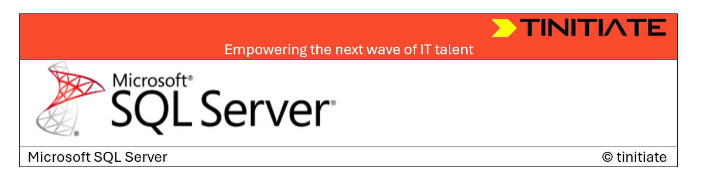

# SQLServer Tutorial

&copy; TINITIATE.COM

# Monitoring & Troubleshooting

## SQL Profiler & Extended Events

* SQL Profiler

* A legacy tool for tracing SQL events (query text, execution time, CPU, reads/writes, locks).

* Still useful for demos but deprecated → not recommended in production.

* Use for learning and quick tests, not for heavy workloads.

* High overhead if left running for long.

* In SSMS → Tools → SQL Server Profiler → connect → start a new trace → filter by database.

```sql
SELECT * FROM employees.emp WHERE deptno = 30;
```

* Students can see the query captured in Profiler with CPU and duration.

## Extended Events (XEvents)

* Lightweight replacement for Profiler.

* Lower overhead, more flexible, integrated into SSMS.

```sql
-- Create an Extended Events session to capture long-running queries
CREATE EVENT SESSION LongQueries
ON SERVER
ADD EVENT sqlserver.sql_statement_completed
(
    ACTION (sqlserver.sql_text, sqlserver.database_name)
    WHERE duration > 500000 -- microseconds (~0.5 sec)
)
ADD TARGET package0.event_file (SET filename = 'C:\XE\LongQueries.xel');
GO

ALTER EVENT SESSION LongQueries ON SERVER STATE = START;

```

* Ask students to run queries with/without indexes.

* View captured events in SSMS → Management → Extended Events → Sessions.

## Using DMVs (Dynamic Management Views) for Performance Tuning

* DMVs expose live system information: queries, sessions, waits, indexes.

* Extremely powerful for diagnosing real-time bottlenecks.

* Key DMVs:

* **Query Performance**
```sql
-- Top CPU-consuming queries
SELECT TOP 5 
    qs.total_worker_time/1000 AS CPU_ms,
    qs.execution_count,
    qs.total_elapsed_time/1000 AS Duration_ms,
    SUBSTRING(qt.text, qs.statement_start_offset/2,
              (CASE WHEN qs.statement_end_offset = -1 
                    THEN LEN(CONVERT(NVARCHAR(MAX), qt.text)) * 2 
                    ELSE qs.statement_end_offset END - qs.statement_start_offset)/2) AS QueryText
FROM sys.dm_exec_query_stats qs
CROSS APPLY sys.dm_exec_sql_text(qs.sql_handle) qt
ORDER BY CPU_ms DESC;
```

* **Missing Indexes**
```sql
SELECT TOP 10
  mid.statement AS TableName,
  mid.equality_columns,
  mid.inequality_columns,
  migs.user_seeks, migs.user_scans
FROM sys.dm_db_missing_index_group_stats migs
JOIN sys.dm_db_missing_index_groups mig ON migs.group_handle = mig.index_group_handle
JOIN sys.dm_db_missing_index_details mid ON mig.index_handle = mid.index_handle
ORDER BY migs.user_seeks DESC;
```

* **Current Activity**

```sql
SELECT session_id, status, wait_type, blocking_session_id, cpu_time, total_elapsed_time,
       SUBSTRING(qt.text, r.statement_start_offset/2, 
          (CASE WHEN r.statement_end_offset = -1 
                THEN LEN(CONVERT(NVARCHAR(MAX), qt.text)) * 2 
                ELSE r.statement_end_offset END - r.statement_start_offset)/2) AS RunningSQL
FROM sys.dm_exec_requests r
CROSS APPLY sys.dm_exec_sql_text(r.sql_handle) qt;
```

* DMVs reveal “what’s happening right now.”

* use DMVs instead of just guessing.

3. Query Store Basics

* Query Store = “black box recorder” for queries, plans, runtime stats.

* Helps find regressed plans and force stable ones.

* Key Features:

* Captures **query text, plans, runtime stats** automatically.

* Detects when the same query suddenly runs slower (plan regression).

* Allows **plan forcing**.

```sql
-- Enable Query Store (test database)
ALTER DATABASE CURRENT SET QUERY_STORE = ON;
ALTER DATABASE CURRENT SET QUERY_STORE (OPERATION_MODE = READ_WRITE);

-- Find high-duration queries
SELECT TOP 10
  qt.query_sql_text,
  rs.avg_duration, rs.last_execution_time
FROM sys.query_store_runtime_stats rs
JOIN sys.query_store_plan qp ON rs.plan_id = qp.plan_id
JOIN sys.query_store_query q ON qp.query_id = q.query_id
JOIN sys.query_store_query_text qt ON q.query_text_id = qt.query_text_id
ORDER BY rs.avg_duration DESC;

```

* Query Store as a performance history log.


## Deadlocks & Blocking

**Blocking**

* Happens when one session locks a row and another waits.

```sql

-- Session A
BEGIN TRAN;
UPDATE employees.emp SET sal = sal+100 WHERE empno = 7369;

-- Session B (blocked)
SELECT * FROM employees.emp WHERE empno = 7369;

```
**Deadlock**
* Two sessions wait on each other → SQL automatically kills one.


* Session A:
```sql
BEGIN TRAN;
UPDATE employees.emp SET sal = sal+10 WHERE empno = 7369;
```

* Session B:
```sql
BEGIN TRAN;
UPDATE employees.emp SET sal = sal+20 WHERE empno = 7499;
```

* Session A tries:

```sql
UPDATE employees.emp SET sal = sal+30 WHERE empno = 7499;
```

* Session B tries:

```sql
UPDATE employees.emp SET sal = sal+40 WHERE empno = 7369;
```

* → Deadlock occurs. SQL Server picks a “victim.”

**How to Detect:**

* Extended Events (xml_deadlock_report).

* DMVs (sys.dm_tran_locks).

**Fixes**:

* Keep transactions short.

* Always access tables in same order across procedures.

## Wait Statistics

* Wait stats show where SQL is waiting (I/O, locks, memory, CPU).

* SQL Server spends most of its time “waiting.”

* Different wait types indicate different bottlenecks.

Common Waits:

* CXPACKET → parallelism overhead.

* PAGEIOLATCH → slow I/O.

* LCK_M_X → blocking on exclusive locks.

* SOS_SCHEDULER_YIELD → CPU pressure.

```sql
-- Top waits
SELECT TOP 10 wait_type, wait_time_ms/1000.0 AS WaitTimeSec, waiting_tasks_count
FROM sys.dm_os_wait_stats
ORDER BY wait_time_ms DESC;
```
